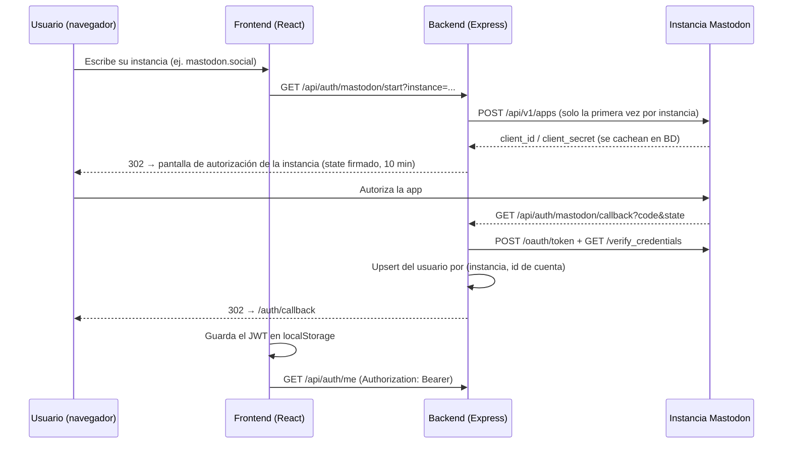

# WeedTown 🌍🌿

**WeedTown** es una red social para nómadas digitales: compartir experiencias, conectar con otros viajeros y acceder a espacios de arrendamiento de inmuebles en distintas partes del mundo. Combina feed social, foros temáticos, chat en tiempo real y un espacio de comercio, accesible desde web y móvil, con panel administrativo para moderación.

La identidad de los usuarios es **federada**: no hay registro propio, se inicia sesión con cualquier cuenta de **Mastodon** (fediverso) vía OAuth 2.0.

---

## 📌 Estado del proyecto

| Funcionalidad | Estado |
|---|---|
| Identidad federada con Mastodon (cualquier instancia) | ✅ Funcionando |
| Feed de posteos con texto, imagen y hashtags (paginado + búsqueda) | ✅ Funcionando |
| Perfil de usuario (ver y editar el propio) | ✅ Funcionando |
| Base de datos PostgreSQL en Supabase (Prisma ORM) | ✅ Funcionando |
| Likes y comentarios | 🚧 Modelado en BD, endpoints pendientes |
| Foros con categorías | 🚧 Modelado en BD, endpoints stub |
| Chat 1 a 1 en tiempo real (Socket.IO) | 🚧 Modelado en BD, endpoints stub |
| Comercio / arrendamiento de inmuebles | 🚧 Modelado en BD, endpoints stub |
| Panel administrativo | 🚧 Pendiente |
| App móvil (Expo) | 🚧 Demo mínima, no conectada al flujo actual |
| Endurecimiento de seguridad (helmet, rate limit, CORS estricto) | 📋 Planificado |

---

## 🧭 Arquitectura

Monorepo con cuatro módulos:

```
/weedtown
├── backend/            API REST (Express + Prisma)
│   ├── app.js          Entrada: middlewares, rutas, Swagger UI, /health
│   ├── prisma/         schema.prisma + migraciones
│   └── src/
│       ├── lib/        Cliente Prisma (singleton)
│       ├── middlewares/  errorHandler, requireAuth (JWT)
│       └── routes/     auth, posts, profile, forum*, chat*, market*, admin*  (* = stub)
├── frontend/           Web (React 18 + CRA + React Router)
│   └── src/
│       ├── components/ Navbar, PostCard, PostModal, ForumCategoryModal
│       ├── hooks/      useAuth (AuthProvider + sesión en localStorage)
│       ├── pages/      Login, AuthCallback, Feed, Forum, Chat, Profile
│       └── services/   api.js (axios con Authorization automático)
├── mobile/             App móvil (Expo / React Native) — demo
└── admin-panel/        Panel administrativo — pendiente
```

### Autenticación federada (Mastodon OAuth 2.0)



Puntos clave del diseño:
- **Multi-instancia**: la app se registra dinámicamente en cada instancia de Mastodon la primera vez que un usuario de esa instancia inicia sesión (tabla `MastodonApp`).
- **Sin contraseñas propias**: el modelo `User` no guarda password; la identidad única es `(mastodonInstance, mastodonId)`. Mastodon no expone el email, por eso es opcional.
- **Sesión**: JWT propio firmado con `JWT_SECRET`, enviado en el header `Authorization: Bearer`. El `state` de OAuth también va firmado (anti-CSRF, expira en 10 minutos).

---

## 🛠️ Stack tecnológico

| Capa | Tecnología |
|---|---|
| API | Node.js 18+, Express 4 |
| Identidad | OAuth 2.0 de Mastodon + JWT (`jsonwebtoken`) |
| Base de datos | PostgreSQL gestionado en **Supabase** (dev/pruebas); Prisma ORM 6 |
| Web | React 18, React Router 6, Axios (Create React App) |
| Móvil | Expo / React Native |
| Docs API | Swagger UI en `/api-docs` |
| Tiempo real | Socket.IO *(pendiente de implementar en backend)* |

En producción la base de datos puede apuntar a cualquier PostgreSQL: solo cambian `DATABASE_URL` y `DIRECT_URL`.

---

## 🚀 Arranque local

Requisitos: Node.js 18+, una cuenta en [Supabase](https://supabase.com) (plan gratuito) y una cuenta Mastodon para probar el login.

### 1. Base de datos (Supabase)

Crea un proyecto y copia las cadenas de conexión desde **Connect → ORMs → Prisma**:
- *Transaction pooler* (puerto **6543**) → `DATABASE_URL` (agregar `?pgbouncer=true&connection_limit=1`)
- *Session pooler* (puerto **5432**) → `DIRECT_URL` (la usan las migraciones)

### 2. Backend

```bash
cd backend
cp .env.example .env    # completar DATABASE_URL, DIRECT_URL y JWT_SECRET
npm install
npx prisma migrate dev  # crea las tablas en Supabase
npm run dev             # http://localhost:4000
```

Comprueba `http://localhost:4000/health` → debe responder `{"status":"ok","db":"ok"}`.

### 3. Frontend

```bash
cd frontend
npm install
npm start               # http://localhost:3000
```

En `/login` escribe tu instancia de Mastodon (ej. `mastodon.social`), autoriza la app y caerás en el feed con tu sesión activa (sobrevive al refresh).

### Variables de entorno (backend/.env)

| Variable | Descripción |
|---|---|
| `DATABASE_URL` | Postgres vía pooler en modo transacción (runtime) |
| `DIRECT_URL` | Postgres conexión directa/sesión (migraciones de Prisma) |
| `JWT_SECRET` | Secreto para firmar los JWT de sesión y el `state` de OAuth. Usar un valor largo y aleatorio |
| `BACKEND_URL` | URL pública del backend; forma el `redirect_uri` de OAuth (`{BACKEND_URL}/api/auth/mastodon/callback`) |
| `FRONTEND_URL` | URL del frontend; destino de los redirects post-login |
| `PORT` | Puerto del backend (default 4000) |

> ⚠️ `.env` está en `.gitignore` y nunca debe commitearse. Si el `redirect_uri` cambia (p. ej. al desplegar), borra las filas de `MastodonApp` para que las apps se re-registren con la nueva URL.

---

## 📡 API

Documentación interactiva completa en **`http://localhost:4000/api-docs`** (Swagger). Resumen:

| Método | Ruta | Auth | Descripción |
|---|---|---|---|
| GET | `/health` | — | Estado del proceso y de la BD |
| GET | `/api/auth/mastodon/start?instance=` | — | Inicia el flujo OAuth (redirige a la instancia) |
| GET | `/api/auth/mastodon/callback` | — | Callback OAuth (uso interno del flujo) |
| GET | `/api/auth/me` | 🔒 | Usuario de la sesión actual |
| GET | `/api/posts?page=` | — | Feed paginado (20 por página) |
| POST | `/api/posts` | 🔒 | Crear posteo (`content`, `image?`, `hashtags?[]`) |
| GET | `/api/posts/search?q=` | — | Búsqueda por contenido o autor |
| GET | `/api/profile/me` | 🔒 | Perfil propio |
| PUT | `/api/profile/me` | 🔒 | Actualizar perfil propio |
| GET | `/api/profile/:id` | — | Perfil público por id |

🔒 = requiere header `Authorization: Bearer <jwt>`. Las rutas de foro, chat, market y admin existen como stubs y responden mensajes fijos hasta su implementación.

---

## 🗺️ Roadmap

1. **Endurecimiento**: helmet, rate limiting en auth, CORS restringido por origen, límites de payload, ocultar PII de perfiles públicos, rotación de secretos, cookies httpOnly.
2. **Features**: likes y comentarios, foros, chat en tiempo real (Socket.IO en backend), market de inmuebles, panel admin.
3. **Móvil**: conectar la app Expo al flujo de auth y API actuales.
4. **Infra**: almacenamiento de imágenes (Cloudinary/S3), Docker, CI con tests.

---

## 🤝 Contribuciones

¡Las contribuciones son bienvenidas! Abre un issue o pull request para sugerencias o mejoras.
