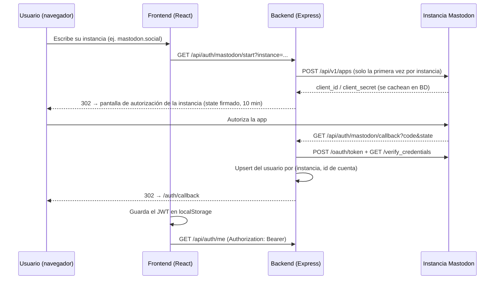

# WeedTown 🇲🇽🌿

**WeedTown** es una red social para la **comunidad cannábica de México**: un espacio digital de **seguridad y respeto** donde la comunidad pacheca puede compartir, aprender, conectar y crecer sin estigma. Combina feed social, foros temáticos y chat, y en una fase posterior un **mercado de tangibles e intangibles diversos** (merch, arte, glass, talleres, servicios) creado por y para la comunidad.

---

## 🌱 Visión y principios

- **Seguridad primero**: la privacidad no es una feature, es la base. La identidad es **federada vía Mastodon**: WeedTown no crea contraseñas, no exige email y permite participar con el seudónimo del fediverso. Los datos personales del perfil son opcionales.
- **Respeto y comunidad**: espacio libre de estigma, con moderación orientada a proteger a las personas usuarias. La cultura cannábica mexicana es el centro: educación, reducción de riesgos, arte y cultura.
- **Legalidad**: el contenido y el futuro mercado operan dentro del marco legal mexicano. El mercado está pensado para productos y servicios lícitos de la cultura cannábica (parafernalia, merch, arte, cursos, asesorías) — **no** para la compraventa de sustancias.
- **Minimalismo funcional**: interfaz Material Design (claro/oscuro), accesible y sin fricción.

## 🎯 Prioridades

1. **Robustecer la red social** (fase actual): likes y comentarios, foros por categoría, chat en tiempo real, moderación.
2. **Mercado comunitario** (fase posterior): catálogo de tangibles e intangibles con perfiles de vendedor de la propia comunidad.

---

## 📌 Estado del proyecto

| Funcionalidad | Estado |
|---|---|
| Identidad federada con Mastodon (cualquier instancia) | ✅ Funcionando |
| Feed de posteos con texto, imagen y hashtags (paginado + búsqueda) | ✅ Funcionando |
| Perfil de usuario (ver y editar el propio, datos opcionales) | ✅ Funcionando |
| UI Material Design con modo claro/oscuro accesible | ✅ Funcionando |
| Base de datos PostgreSQL en Supabase (Prisma ORM) | ✅ Funcionando |
| Reacciones cannábicas en posts y comentarios (👍 Me gusta, 🌿 Me rola, 👀 Me interesa, 😒 Me molesta) | ✅ Funcionando |
| Comentarios en posteos | ✅ Funcionando |
| Imagen opcional en posts y comentarios (≤5 MB, anonimizada sin EXIF/GPS en el cliente) | ✅ Funcionando |
| Foros estilo Reddit: subforos comunitarios, hilos a 3 niveles, órdenes Relevante/Nuevo/Top | ✅ Funcionando |
| Seguir subforos + notificaciones in-app (campana con contador) | ✅ Funcionando |
| Editar/eliminar contenido propio (feed y foro, con borrado suave en hilos) | ✅ Funcionando |
| Endurecimiento de seguridad (helmet, rate limit, CORS estricto, validación, sin PII pública) | ✅ Funcionando |
| Chat 1 a 1 en tiempo real (Socket.IO + REST, búsqueda de personas, historial paginado) | ✅ Funcionando |
| "Cerca": mapa de comunidad por zonas de ~5 km (ofuscación en el cliente, recíproco, caduca en 7 días) | ✅ Funcionando |
| Mercado comunitario (tangibles e intangibles) | 📋 Fase posterior |
| Panel administrativo / moderación (rol + reportes, integrado al frontend en `/admin`) | 📋 Planificado — antes del chat/mercado |
| App móvil (Expo) | 🚧 Demo mínima, no conectada al flujo actual |

---

## 🧭 Arquitectura

Monorepo con cuatro módulos:

```
/weedtown
├── backend/            API REST (Express + Prisma)
│   ├── app.js          Entrada: middlewares, rutas, Swagger UI, /health
│   ├── prisma/         schema.prisma + migraciones
│   └── src/
│       ├── lib/        Cliente Prisma (singleton)
│       ├── middlewares/  errorHandler, requireAuth (JWT)
│       └── routes/     auth, posts, comments, media, forum, chat, notifications, market*, admin*  (* = stub)
├── frontend/           Web (React 18 + CRA + MUI v5 + React Router)
│   └── src/
│       ├── components/ Navbar, PostCard, PostModal, RequireAuth, ...
│       ├── hooks/      useAuth (AuthProvider + sesión en localStorage)
│       ├── pages/      Login, AuthCallback, Feed, Forum, Chat, Profile
│       ├── services/   api.js (axios con Authorization automático)
│       └── theme.js    Tema Material claro/oscuro (sistema + toggle persistido)
├── mobile/             App móvil (Expo / React Native) — demo
└── admin-panel/        Panel de moderación — pendiente
```

### Autenticación federada (Mastodon OAuth 2.0)



Puntos clave del diseño:
- **Multi-instancia**: la app se registra dinámicamente en cada instancia de Mastodon la primera vez que un usuario de esa instancia inicia sesión (tabla `MastodonApp`).
- **Seudonimato por diseño**: el modelo `User` no guarda password y el email es opcional (Mastodon no lo expone); la identidad única es `(mastodonInstance, mastodonId)`.
- **Sesión**: JWT propio firmado con `JWT_SECRET`, enviado en el header `Authorization: Bearer`. El `state` de OAuth también va firmado (anti-CSRF, expira en 10 minutos).

### Endurecimiento del backend

- **helmet**: headers de seguridad (CORP en `cross-origin` para servir `/uploads` al frontend); `x-powered-by` deshabilitado.
- **CORS estricto**: solo se acepta el origen de `FRONTEND_URL`.
- **Rate limiting**: 300 peticiones/15 min por IP en toda la API; 20/15 min en el flujo OAuth (`/api/auth/mastodon/*`). Respeta proxies (`trust proxy`).
- **Límites de payload**: body JSON ≤ 100 kB; imágenes ≤ 5 MB por multipart (multer, solo JPG/PNG/WebP, nombre aleatorio).
- **Límites de contenido**: post del feed ≤ 2000 caracteres, comentario ≤ 1000; post de foro ≤ 10000, comentario de foro ≤ 2000; máximo 10 hashtags de ≤ 30 caracteres; bio ≤ 500. El campo `image` debe ser URL http(s).
- **Privacidad**: el perfil público (`GET /api/profile/:id`) no expone email, teléfono, nombre real, edad, fecha de nacimiento ni género — esos datos solo los ve su dueño en `/api/profile/me`.
- **Errores sanitizados**: el detalle (stack, Prisma) solo se registra en el servidor; el cliente recibe mensajes genéricos salvo en errores de validación.

---

## 🛠️ Stack tecnológico

| Capa | Tecnología |
|---|---|
| API | Node.js 18+, Express 4 |
| Identidad | OAuth 2.0 de Mastodon + JWT (`jsonwebtoken`) |
| Base de datos | PostgreSQL gestionado en **Supabase** (dev/pruebas); Prisma ORM 6 |
| Web | React 18, **MUI v5** (Material Design, claro/oscuro), React Router 6, Axios |
| Móvil | Expo / React Native |
| Docs API | Swagger UI en `/api-docs` |
| Tiempo real | Socket.IO 4 (handshake autenticado con el JWT de sesión; entrega de mensajes en vivo) |

Notas:
- En producción la base de datos puede apuntar a cualquier PostgreSQL: solo cambian `DATABASE_URL` y `DIRECT_URL`.
- MUI está **fijado en v5**: la v9 es incompatible con Create React App (react-scripts 5). No actualizar de major sin migrar el bundler.

---

## 🚀 Arranque local

Requisitos: Node.js 18+, una cuenta en [Supabase](https://supabase.com) (plan gratuito) y una cuenta Mastodon para probar el login.

### 1. Base de datos (Supabase)

Crea un proyecto y copia las cadenas de conexión desde **Connect → ORMs → Prisma**:
- *Transaction pooler* (puerto **6543**) → `DATABASE_URL` (agregar `?pgbouncer=true&connection_limit=1`)
- *Session pooler* (puerto **5432**) → `DIRECT_URL` (la usan las migraciones)

### 2. Backend

```bash
cd backend
cp .env.example .env    # completar DATABASE_URL, DIRECT_URL y JWT_SECRET
npm install
npx prisma migrate dev  # crea las tablas en Supabase
npm run dev             # http://localhost:4000
```

Comprueba `http://localhost:4000/health` → debe responder `{"status":"ok","db":"ok"}`.

### 3. Frontend

```bash
cd frontend
npm install
npm start               # http://localhost:3000
```

En `/login` escribe tu instancia de Mastodon (ej. `mastodon.social`), autoriza la app y caerás en el feed con tu sesión activa (sobrevive al refresh).

### Acceso desde otras máquinas de la red local

El frontend deduce la URL del backend del hostname con el que abriste la página (localhost o IP LAN, puerto 4000), así que basta con:

1. En `backend/.env`: poner `BACKEND_URL`/`FRONTEND_URL` con la IP LAN (ej. `http://192.168.1.77:4000` / `:3000`) y agregar ambos orígenes a `ALLOWED_ORIGINS` (CORS).
2. Vaciar la tabla `MastodonApp` (el `redirect_uri` de OAuth cambió; las apps se re-registran solas en el próximo login).
3. Permitir `node.exe` en el firewall de Windows para el perfil de red activo (normalmente ya existe la regla por el aviso que muestra Windows al primer arranque).

Después, desde cualquier equipo de la red: `http://<IP-LAN>:3000`.

### Variables de entorno (backend/.env)

| Variable | Descripción |
|---|---|
| `DATABASE_URL` | Postgres vía pooler en modo transacción (runtime) |
| `DIRECT_URL` | Postgres conexión directa/sesión (migraciones de Prisma) |
| `JWT_SECRET` | Secreto para firmar los JWT de sesión y el `state` de OAuth. Usar un valor largo y aleatorio |
| `BACKEND_URL` | URL pública del backend; forma el `redirect_uri` de OAuth (`{BACKEND_URL}/api/auth/mastodon/callback`) |
| `FRONTEND_URL` | URL del frontend; destino de los redirects post-login |
| `PORT` | Puerto del backend (default 4000) |

> ⚠️ `.env` está en `.gitignore` y nunca debe commitearse. Si el `redirect_uri` cambia (p. ej. al desplegar), borra las filas de `MastodonApp` para que las apps se re-registren con la nueva URL.

---

## 📡 API

Documentación interactiva completa en **`http://localhost:4000/api-docs`** (Swagger). Resumen:

| Método | Ruta | Auth | Descripción |
|---|---|---|---|
| GET | `/health` | — | Estado del proceso y de la BD |
| GET | `/api/auth/mastodon/start?instance=` | — | Inicia el flujo OAuth (redirige a la instancia) |
| GET | `/api/auth/mastodon/callback` | — | Callback OAuth (uso interno del flujo) |
| GET | `/api/auth/me` | 🔒 | Usuario de la sesión actual |
| GET | `/api/posts?page=` | — | Feed paginado (20 por página) |
| POST | `/api/posts` | 🔒 | Crear posteo (`content`, `image?`, `hashtags?[]`) |
| GET | `/api/posts/search?q=` | — | Búsqueda por contenido o autor |
| POST | `/api/posts/:id/reaction` | 🔒 | Reaccionar (`type`: LIKE/ROLA/INTERESA/MOLESTA; misma = quitar, distinta = reemplazar) |
| DELETE | `/api/posts/:id/reaction` | 🔒 | Quitar la reacción propia |
| POST | `/api/posts/:id/like` | 🔒 | Alias de compatibilidad → reacción LIKE |
| POST | `/api/posts/:id/comment` | 🔒 | Comentar un posteo |
| GET | `/api/posts/:id/comments` | — | Comentarios con conteos de reacciones |
| POST/DELETE | `/api/comments/:id/reaction` | 🔒 | Reaccionar / quitar reacción en un comentario |
| POST | `/api/media/upload` | 🔒 | Subir imagen (multipart, ≤5 MB, JPG/PNG/WebP) → devuelve URL |
| GET/POST | `/api/forum/subforums` | —/🔒 | Directorio de subforos / crear (máx. 3 por usuario) |
| POST/DELETE | `/api/forum/subforums/:slug/follow` | 🔒 | Seguir / dejar de seguir un subforo |
| GET/POST | `/api/forum/subforums/:slug/posts` | —/🔒 | Posts del subforo (`?sort=hot\|new\|top&period=`) / publicar |
| GET/PUT/DELETE | `/api/forum/posts/:id` | —/🔒 | Detalle / editar / eliminar post propio |
| GET/POST | `/api/forum/posts/:id/comments` | —/🔒 | Hilo de comentarios / comentar o responder (`parentId?`) |
| POST/DELETE | `/api/forum/posts/:id/reaction` | 🔒 | Reaccionar al post del foro (puntúa ±1) |
| PUT/DELETE | `/api/forum/comments/:id` | 🔒 | Editar / eliminar comentario propio (suave si tiene respuestas) |
| POST | `/api/forum/comments/:id/reaction` | 🔒 | Reaccionar a comentario del foro (puntúa ±1) |
| GET | `/api/notifications` (+`/unread-count`, `POST /read-all`) | 🔒 | Centro de notificaciones in-app |
| GET | `/api/profile/me` | 🔒 | Perfil propio |
| PUT | `/api/profile/me` | 🔒 | Actualizar perfil propio |
| GET | `/api/profile/:id` | — | Perfil público por id |

| GET | `/api/chat/users?q=` | 🔒 | Buscar personas para chatear (datos públicos) |
| GET | `/api/chat/conversations` | 🔒 | Mis conversaciones (con último mensaje) |
| POST | `/api/chat/conversations` | 🔒 | Abrir/recuperar conversación 1 a 1 (`userId`) |
| GET | `/api/chat/conversations/:id/messages?before=` | 🔒 | Hilo de mensajes (50 por página, `before` para historial) |
| POST | `/api/chat/conversations/:id/messages` | 🔒 | Enviar mensaje (≤1000 caracteres; entrega en vivo por socket) |

🔒 = requiere header `Authorization: Bearer <jwt>`. Las rutas de mercado y admin existen como stubs y responden mensajes fijos hasta su implementación.

### "Cerca": descubrimiento por zonas con privacidad

| Método | Ruta | Auth | Descripción |
|---|---|---|---|
| GET | `/api/nearby/location` | 🔒 | Mi estado (¿comparto zona? cuál) |
| PUT | `/api/nearby/location` | 🔒 | Activar/actualizar mi zona (`cell`: geohash-5; rechaza coordenadas) |
| DELETE | `/api/nearby/location` | 🔒 | Dejar de compartir (borra la celda) |
| GET | `/api/nearby` | 🔒 | Personas y zonas cercanas (requiere compartir: recíproco) |

Diseño de privacidad: el navegador convierte el GPS a una **celda geohash de ~5 km antes de enviar nada** (el servidor nunca ve coordenadas; el endpoint las rechaza explícitamente). La cuadrícula es fija — todos los de una celda son indistinguibles, no hay nada que triangular. Solo ves a otros si compartes tu zona, la celda **caduca a los 7 días** y puede borrarse en un clic. El mapa (Leaflet + OpenStreetMap) muestra zonas agregadas con conteo, nunca pins individuales. La consulta busca en una cuadrícula 5×5 de celdas (~12 km de radio efectivo) y tiene rate limit propio anti-scraping.

### Chat en tiempo real

El envío de mensajes entra **por REST** (hereda auth, rate limit y validación) y la entrega en vivo sale **por Socket.IO**: cada usuario autentica el handshake con su JWT (`auth.token`) y se une a su sala personal `user:{id}`, donde recibe el evento `chat:message` de todas sus conversaciones, en todas sus sesiones abiertas.

**Mecánica del foro (modelo Reddit)**: las reacciones son el voto — 👍🌿👀 suman +1, 😒 resta −1. El orden *Relevante* usa `score/(horas+2)^1.5` (decaimiento temporal), *Top* filtra por periodo. Hilos anidados hasta 3 niveles (más profundo se aplana con "en respuesta a @usuario"). Notificaciones: respuesta a tu post, respuesta a tu comentario y post nuevo en subforos que sigues.

---

## 🗺️ Roadmap

**Fase 1 — Robustecer la red social** *(actual)*
1. ~~Reacciones cannábicas y comentarios en posteos~~ ✅ (HU-RC-001)
2. ~~Foros estilo Reddit: subforos, puntaje por reacciones, hilos, follows y notificaciones~~ ✅
3. ~~Endurecimiento: helmet, rate limiting, CORS restringido, límites de payload y de contenido, PII fuera de los perfiles públicos, errores sanitizados~~ ✅
4. ~~Chat 1 a 1 en tiempo real (Socket.IO + REST)~~ ✅
5. Herramientas de moderación básicas (rol de usuario, reportes, ocultar/suspender) con panel en `/admin` del mismo frontend — **siguiente**.

**Fase 2 — Mercado comunitario**
- Catálogo de tangibles e intangibles lícitos (merch, arte, glass, talleres, cursos, servicios), perfiles de vendedor, búsqueda por categoría. El modelo `MarketItem` existente evolucionará hacia este diseño.

**Fase 3 — Alcance**
- App móvil (Expo) conectada al flujo real, panel de moderación/administración, almacenamiento de imágenes (Cloudinary/S3), Docker y CI con tests.

---

## 🤝 Contribuciones

¡Las contribuciones son bienvenidas! Abre un issue o pull request para sugerencias o mejoras. Este proyecto se construye con y para la comunidad — el respeto es innegociable.
