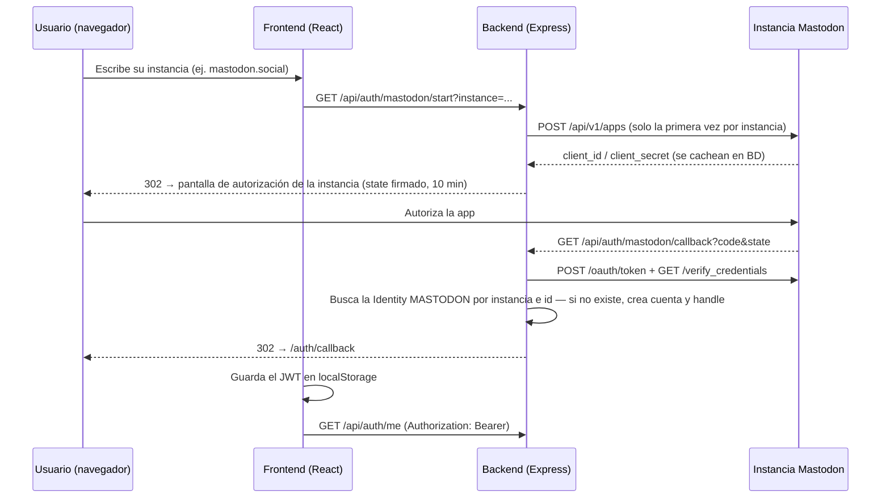

# WeedTown 🇲🇽🌿

**WeedTown** es una red social para la **comunidad cannábica de México**: un espacio digital de **seguridad y respeto** donde la comunidad pacheca puede compartir, aprender, conectar y crecer sin estigma. Combina feed social, foros temáticos y chat, y en una fase posterior un **mercado de tangibles e intangibles diversos** (merch, arte, glass, talleres, servicios) creado por y para la comunidad.

---

## 🌱 Visión y principios

- **Seguridad primero**: la privacidad no es una feature, es la base. La identidad es **federada vía Mastodon**: WeedTown no crea contraseñas, no exige email y permite participar con el seudónimo del fediverso. Los datos personales del perfil son opcionales. Y la protección no es solo frente al servidor: cualquiera puede **bloquear** a quien le incomode, con efecto inmediato en todas las superficies de contacto.
- **Respeto y comunidad**: espacio libre de estigma, con moderación orientada a proteger a las personas usuarias. La cultura cannábica mexicana es el centro: educación, reducción de riesgos, arte y cultura.
- **Legalidad**: el contenido y el futuro mercado operan dentro del marco legal mexicano. El mercado está pensado para productos y servicios lícitos de la cultura cannábica (parafernalia, merch, arte, cursos, asesorías) — **no** para la compraventa de sustancias.
- **Minimalismo funcional**: interfaz Material Design (claro/oscuro), accesible y sin fricción.

## 🎯 Prioridades

1. **Robustecer la red social** (fase actual): likes y comentarios, foros por categoría, chat en tiempo real, moderación.
2. **Mercado comunitario** (fase posterior): catálogo de tangibles e intangibles con perfiles de vendedor de la propia comunidad.

---

## 📌 Estado del proyecto

| Funcionalidad | Estado |
|---|---|
| Identidad federada con Mastodon (cualquier instancia) | ✅ Funcionando |
| Identidad desacoplada del proveedor (`Identity`) y handle propio de WeedTown | ✅ Funcionando |
| Llaves de acceso (passkey/WebAuthn) y correo con enlace mágico | ✅ Funcionando |
| Feed de posteos con texto, imagen y hashtags (paginado + búsqueda) | ✅ Funcionando |
| Contenido en vivo sin recargar: feed avisa de posts nuevos, logo del header refresca, bandeja de amigos se actualiza sola | ✅ Funcionando |
| Perfil de usuario (ver y editar el propio, datos opcionales) | ✅ Funcionando |
| Avatares pixel art generados por piezas (30,720 combinaciones, sin subir imágenes) | ✅ Funcionando |
| UI Material Design con modo claro/oscuro accesible | ✅ Funcionando |
| Base de datos PostgreSQL en Supabase (Prisma ORM) | ✅ Funcionando |
| Reacciones cannábicas en posts y comentarios (👍 Me gusta, 🌿 Me rola, 👀 Me interesa, 😒 Me molesta) | ✅ Funcionando |
| Comentarios en posteos | ✅ Funcionando |
| Imagen opcional en posts y comentarios (≤5 MB, anonimizada sin EXIF/GPS en el cliente); en táctil, tomar la foto directo con la cámara o elegirla de galería | ✅ Funcionando |
| Foros estilo Reddit: subforos comunitarios, hilos a 3 niveles, órdenes Relevante/Nuevo/Top | ✅ Funcionando |
| Foros: el directorio (nombres/descripciones) es público; el contenido (posts y comentarios) exige sesión — ver nota en la sección de API | ✅ Funcionando |
| Seguir subforos + notificaciones in-app (campana con contador): respuestas y reacciones en el feed, mensajes de chat (colapsados), toques, amistad y foro | ✅ Funcionando |
| Editar/eliminar contenido propio (feed y foro, con borrado suave en hilos) | ✅ Funcionando |
| Endurecimiento de seguridad (helmet, rate limit, CORS estricto, validación, sin PII pública) | ✅ Funcionando |
| Chat 1 a 1 en tiempo real (Socket.IO + REST, búsqueda de personas, historial paginado) | ✅ Funcionando |
| "Cerca": mapa de comunidad por zonas de ~2 km con toque 👋 (ofuscación en el cliente, recíproco, caduca en 7 días); distingue amistades en la lista y permite filtrar solo por ellas | ✅ Funcionando |
| Bloquear personas (efecto mutuo en feed, foros, chat y Cerca; silencioso y reversible) | ✅ Funcionando |
| Amistad (solicitud + aceptación mutua), posteos "solo amigos", perfil ajeno con "sobre mí" y búsqueda de personas | ✅ Funcionando |
| Rol de cuenta (`USER`/`MOD`/`ADMIN`) y superficie `/api/admin` cerrada por rol | ✅ Funcionando |
| Panóptico: indicadores agregados de crecimiento, actividad, salud social, foros y moderación dentro de `/admin` (solo `ADMIN`), sobre columnas ya existentes — cero migraciones | ✅ Funcionando |
| Almacenamiento de imágenes intercambiable (disco local en dev, Supabase Storage en prod) con borrado real al eliminar contenido | ✅ Funcionando |
| Web responsiva para móvil (barra flotante inferior + menú de avatar, chat de una vista, mapa adaptable) | ✅ Funcionando |
| Reportar contenido, cuentas y subforos (motivos tipificados, sin revelar quién reporta) | ✅ Funcionando |
| Panel de moderación en `/admin`: cola de revisión, ocultar contenido, suspender cuentas, gestionar subforos y bitácora | ✅ Funcionando |
| Exportar mis datos y eliminar (anonimizar) mi cuenta, con bitácora propia | ✅ Funcionando |
| Cuarentena de altas nuevas para contacto directo (toque, chat), diferenciada por método de acceso — HU-SEG-006/007 | ✅ Funcionando |
| Control de spam: contenido repetido en ráfaga y exceso de enlaces por posteo | ✅ Funcionando |
| Pruebas E2E en navegador real (Playwright): passkey, enlace mágico, crear/comentar posteos, navegación móvil | ✅ Funcionando |
| Posteo público por enlace (`/p/:id`, visible sin sesión si es `PUBLIC`); un posteo oculto por moderación deja de resolverse para cualquiera, incluida su propia autora | ✅ Funcionando |
| Bloque de invitación bajo un posteo público para quien no tiene sesión, con atribución de altas (`?ref=post`) sin migración — solo una línea en el log estructurado | ✅ Funcionando |
| Posteo no accesible (de amistades o inexistente) sin sesión → redirige a iniciar sesión y regresa al mismo enlace tras el alta, sin bucles ni distinguir "privado" de "no existe" | ✅ Funcionando |
| Comentarios de un posteo público: el contenido solo se lista con sesión (recorte en el servidor); sin sesión se ve el conteo, no el texto | ✅ Funcionando |
| Subforos temáticos institucionales sembrados vía script idempotente (`npm run subforos`) | ✅ Funcionando |
| Ficha de previsualización (Open Graph/Twitter Card) al pegar `/p/:id` en WhatsApp, Telegram, Facebook o X: título, descripción, imagen (propia o de campaña) — armada en el borde con un Worker de Cloudflare, sin depender de que React ni el backend respondan a tiempo | ✅ Funcionando |
| Mercado comunitario (tangibles e intangibles) | 📋 Fase posterior |
| App móvil (Expo) | ❄️ Congelada — demo con datos falsos, sin conexión a la API ([por qué](mobile/README.md)) |

---

## 🧭 Arquitectura

Monorepo con tres módulos — el panel de moderación **no** es uno de ellos: vive en `/admin` del propio frontend, para que la comunidad y quien modera usen la misma URL y la misma sesión.

```
/weedtown
├── .github/workflows/  CI: pruebas del backend (Postgres efímero) y build del frontend
├── backend/            API REST (Express + Prisma)
│   ├── app.js          Entrada: middlewares, rutas, Swagger UI, /health
│   ├── prisma/         schema.prisma + migraciones
│   ├── scripts/        rol.js — asigna el primer MOD/ADMIN (`npm run rol`)
│   │                   subforos.js — siembra el catálogo institucional de subforos (`npm run subforos`)
│   ├── src/
│   │   ├── lib/          Prisma, geogrid, reacciones, bloqueos, amistad, moderación, socket,
│   │   │                 storage, avatar, handle, webauthn, mailer
│   │   ├── middlewares/  errorHandler, requireAuth (JWT), requireRole, requireNotSuspended,
│   │   │                 requireEstablished (cuarentena de altas nuevas)
│   │   └── routes/       auth, auth/passkey, auth/email, posts, comments, media, forum,
│   │                     chat, notifications, nearby, blocks, friends, reports,
│   │                     admin (moderación), market* (* = stub)
│   └── tests/          Pruebas de integración (`npm test`) contra una base aparte
├── frontend/           Web (React 18 + CRA + MUI v5 + React Router)
│   └── src/
│       ├── components/ Navbar, PostCard, InviteBlock, ContentActions, RequireAuth, RequireRole, ...
│       ├── hooks/      useAuth (AuthProvider + sesión en localStorage)
│       ├── lib/        atribucion de altas y validación de `next` (rutaInterna.js)
│       ├── pages/      Login, AuthCallback, Feed, Forum, Chat, Nearby, Profile, PublicProfile,
│       │               PublicPost, Friends, Admin
│       ├── services/   api.js (axios con Authorization automático)
│       └── theme.js    Tema Material claro/oscuro (sistema + toggle persistido)
└── mobile/             App móvil (Expo) — CONGELADA, ver mobile/README.md
```

### Autenticación federada (Mastodon OAuth 2.0)


```mermaid
sequenceDiagram
    participant U as Usuario (navegador)
    participant F as Frontend (React)
    participant B as Backend (Express)
    participant M as Instancia Mastodon

    U->>F: Escribe su instancia (ej. mastodon.social)
    F->>B: GET /api/auth/mastodon/start?instance=...
    B->>M: POST /api/v1/apps (solo la primera vez por instancia)
    M-->>B: client_id / client_secret (se cachean en BD)
    B-->>U: 302 → pantalla de autorización de la instancia (state firmado, 10 min)
    U->>M: Autoriza la app
    M-->>B: GET /api/auth/mastodon/callback?code&state
    B->>M: POST /oauth/token + GET /verify_credentials
    B->>B: Busca la Identity MASTODON por instancia e id — si no existe, crea cuenta y handle
    B-->>U: 302 → /auth/callback#token=JWT (7 días)
    F->>F: Guarda el JWT en localStorage
    F->>B: GET /api/auth/me (Authorization: Bearer)
```

Puntos clave del diseño:
- **Multi-instancia**: la app se registra dinámicamente en cada instancia de Mastodon la primera vez que un usuario de esa instancia inicia sesión (tabla `MastodonApp`).
- **Seudonimato por diseño**: el modelo `User` no guarda password y el email es opcional (Mastodon no lo expone). La identidad de acceso vive en `Identity` —`(provider, externalId)`— y el identificador público es `User.handle`, propio de WeedTown.
- **Sesión**: JWT propio firmado con `JWT_SECRET`, enviado en el header `Authorization: Bearer`. El `state` de OAuth también va firmado (anti-CSRF, expira en 10 minutos).

### Llave de acceso (passkey / WebAuthn) y enlace mágico por correo

Etapa 2 del plan de autenticación: dos métodos más hacia la misma cuenta, sin tocar `User` ni `Identity` — exactamente lo que la etapa 1 dejó preparado. `AuthProvider` ahora tiene `MASTODON`, `PASSKEY` y `EMAIL`; cualquiera de los tres lleva a la misma cuenta si hay más de uno registrado.

**Llave de acceso.** Usa [`@simplewebauthn/server`](https://simplewebauthn.dev/) en el backend y `@simplewebauthn/browser` en el frontend — es la única dependencia nueva del proyecto en autenticación, y a propósito: el spec de WebAuthn (parsing CBOR/COSE, validación de attestation, firma ES256) es superficie donde un error sutil compromete la autenticación completa, a diferencia de las utilidades que sí se hicieron sin dependencias (`storage.js`, `avatar.js`).

- Registro y login son dos rutas cada uno (`options` → `verify`). El reto (challenge) no se guarda en el servidor: viaja firmado en un JWT de 5 minutos hacia el navegador y vuelve en la verificación — mismo patrón que el `state` del OAuth de Mastodon.
- `POST /api/auth/passkey/register/options` distingue el modo por la sesión: **con** `Authorization: Bearer` agrega la llave a la cuenta actual; **sin** sesión da de alta una cuenta nueva (`handle` es una sugerencia opcional en el body).
- El login es **usernameless**: pide una llave con `residentKey: 'required'` al registrar, así el navegador puede ofrecer las guardadas de este dominio sin pedir handle ni correo.
- La clave pública y el contador anti-replay viven en un modelo `Passkey` aparte, 1 a 1 con su `Identity` y borrado en cascada con ella — es la única información que este proveedor necesita y que los demás no tienen sentido cargando.
- **El RP ID es el dominio del FRONTEND**, no del backend, y el spec de WebAuthn exige un dominio válido: no funciona sobre una IP de LAN (ej. `http://192.168.1.77:3000`), aunque el resto de la app sí. `localhost` funciona bien para desarrollo; para producción hace falta un dominio real.

**Enlace mágico.** Mismo patrón de dos pasos que el OAuth de Mastodon (`start` → `callback`), pero sin intermediario: el "código" es el token que sale por correo.

- `POST /api/auth/email/start` genera un token de un solo uso (se guarda su hash, nunca el token en claro) con 15 minutos de vida y lo manda por correo. Responde 200 igual sin importar si ese correo ya tiene cuenta o no.
- `GET /api/auth/email/callback?token=` lo canjea, entra a la cuenta existente o la crea si es la primera vez, y redirige a `{FRONTEND_URL}/auth/callback#token=...` — **la misma pantalla que ya usa Mastodon**, así que el callback no necesitó ni una línea de frontend nuevo.
- Con sesión abierta, pedir un enlace no es "entrar": agrega ese correo como respaldo de la cuenta actual (`MagicLink.addToUserId`). Si ese correo ya es el método de otra cuenta, se rechaza — un clic no fusiona cuentas.
- El envío usa un driver intercambiable (`src/lib/mailer.js`, mismo criterio que `storage.js`): `log` (default) imprime el enlace en la consola del backend — funciona sin credenciales en desarrollo, CI y las pruebas de integración — y `resend` manda de verdad vía la API REST de [Resend](https://resend.com). **En producción hay que poner `MAIL_DRIVER=resend`** con `RESEND_API_KEY` y un dominio propio verificado.

**Quitar un método** es una sola ruta genérica para los tres proveedores — `DELETE /api/auth/identities/:id` — porque a todos los describe la misma fila de `Identity`. Rechaza quitar el último método de una cuenta: eso la dejaría sin forma de entrar.

### `/login`: correo primero, y separar entrar de crear cuenta (HU-ACC-001/002/003)

La jerarquía visual original ponía Mastodon primero (`autoFocus` en el campo de instancia, único botón sólido de la pantalla) — el método que menos gente entiende, con la máxima prioridad. El correo, que cualquiera entiende, estaba hasta abajo. El ciclo 2 lo reordenó: **correo → llave de acceso → Mastodon (colapsado)**, con `autoFocus` en el correo.

- **Dos pestañas, *Entrar* / *Crear cuenta***, con los tres métodos debajo en ese orden en ambas. Antes convivían tres modelos mentales en una sola pantalla: la llave pedía un clic explícito para dar de alta, correo y Mastodon la creaban en silencio. Las pestañas separan la intención sin tocar el backend — `POST /api/auth/passkey/register/options` ya distinguía alta de "agregar método" por la sesión, y correo/Mastodon ya creaban cuenta si no existía.
- **Es una garantía de interfaz, no del servidor.** Desde "Entrar", correo y Mastodon siguen creando la cuenta si no existía — el backend no gana ningún parámetro de intención nuevo. Es claridad, no una barrera de seguridad, y está documentado así a propósito: no se debe tratar como si fuera una comprobación real.
- **`POST /api/auth/email/start` sigue respondiendo 200 con el mismo mensaje exista o no la cuenta**, y ninguna pestaña lo filtra: el texto que ve la persona es idéntico en los dos casos.
- **Mastodon vive en un panel colapsado**, cerrado por defecto ("¿Qué es Mastodon? — solo si ya tienes cuenta"), con 2-3 frases de qué es, una línea de cierre ("¿no sabes si tienes? entonces no tienes — entra con tu correo") y una lista curada de instancias (`mstdn.mx`, `mastodon.social`) marcadas como que llevan fuera de WeedTown. El objetivo no es convertir a nadie a Mastodon: es descalificar rápido para no fugar el embudo mandando a alguien a registrarse en un tercero a mitad del alta.

### Cuarentena de cuentas nuevas, diferenciada por método (HU-SEG-006/007)

Abrir el alta trajo un problema que la etapa 1 ya dejó anotado: **cada método nuevo abarata evadir una suspensión**. Con Mastodon, volver cuesta conseguir otra cuenta en una instancia. Con llave de acceso o correo, cuesta un registro instantáneo y gratuito — y el sistema de moderación no tenía ninguna defensa contra eso.

La regla **era binaria** ("¿tiene Mastodon o no?") hasta el ciclo 2, que reordenó `/login` para poner el correo primero — el método que cualquier persona entiende. Eso cambia por completo la *población* sobre la que cae la cuarentena: de golpe, la mayoría de las altas legítimas pasa a ser correo o llave en vez de Mastodon, y una regla de 24 h parejas para las dos les cobraba el mismo precio a un correo verificado (que ya demuestra control de un buzón) que a una llave anónima (que no demuestra nada). La cuarentena se gradúa ahora según el **costo real de conseguir cada método**:

| Identidad de la cuenta | Qué cuesta conseguirla | Cuarentena (default) |
|---|---|---|
| Mastodon | Cuenta en una instancia del fediverso — costo de origen real | Ninguna |
| Correo verificado | Un buzón bajo control, comprobado por el enlace mágico | `SIGNUP_QUARANTINE_HOURS_EMAIL` (3 h) |
| Solo llave de acceso | Registro instantáneo y gratuito, sin ninguna señal | `SIGNUP_QUARANTINE_HOURS_PASSKEY` (24 h) |

- Una cuenta con **varias identidades toma la ventana MÁS CORTA** de las que tenga. Es un costo aceptado a propósito, no un descuido: una llave de acceso más un correo de respaldo baja la espera a la ventana corta, que es justo la conducta que este README quiere fomentar para recuperación de cuenta (ver más abajo) — aunque signifique que alguien puede quemar un correo desechable para bajar de 24 h a unas pocas.
- Aplica a las mismas dos acciones de siempre: mandar un toque de Cerca y abrir una conversación de chat **nueva**. Sí se puede seguir leyendo, publicar, comentar y responder en un chat que alguien más haya abierto — la cuarentena es sobre *contactar por primera vez*, no sobre escribir.
- La función que resuelve la ventana (`estaEstablecida()` en `requireAuth.js`) sigue siendo pura, sin `req`/`res`: `chatRoutes` la llama directo para cuarentenar solo la rama de "conversación nueva", no la de "recuperar una que ya existía".
- El error 403 trae `disponibleEn`; el cliente arma con eso un aviso legible ("puedes hacerlo en unas N horas — es una protección de la comunidad, no un castigo") en vez de mostrar el error genérico.
- Rate limits dedicados en `/api/auth/passkey` y `/api/auth/email` (aparte del general de la API), más un enfriamiento de 60 s por correo destino en `/api/auth/email/start` para que no sirva para mandar spam a un buzón ajeno.

**Lo que esto NO resuelve**, dicho sin rodeos: una cuenta evasora sigue pudiendo publicar y comentar en público desde el minuto uno con una cuenta nueva — igual que cualquier persona nueva legítima. Gatear toda la escritura penalizaría el alta de quien no hizo nada malo, así que ese caso se dejó en manos de la moderación reactiva que ya existe (reportes + ocultar + suspender), no de una regla de antigüedad. Si el volumen de evasión lo justifica, ahí es donde seguiría esta tarea.

### Exportar y eliminar tu cuenta (HU-PRIV-001)

Dos derechos sobre los datos propios, distintos del panel de moderación: acá es la persona ejerciendo control sobre lo suyo, no alguien más decidiendo sobre contenido ajeno. Ambos desde *Perfil → Tus datos*.

- **`GET /api/profile/me/export`** junta el perfil, los métodos de acceso (sin datos internos de una llave — la clave pública no es "tu dato", es un artefacto de seguridad), posts, comentarios, posts y comentarios de foro, bloqueos, reportes hechos, subforos creados/seguidos, mensajes **enviados** (no los recibidos: son en parte el contenido de alguien más) y notificaciones. Se descarga como un `.json`.
- **`DELETE /api/profile/me`** exige repetir el propio handle en `confirm` — no hay contraseña que volver a pedir, y es la única acción del perfil que no se puede deshacer.

**Es anonimización, no borrado de fila**, y a propósito choca con la otra regla del proyecto ("moderación nunca borra nada"): son dos derechos distintos. Moderación preserva evidencia de un reporte; esto es el dueño de sus datos pidiendo que dejen de identificarlo. Como `Post.author`, `Comment.author`, `Message.sender`, etc. son relaciones a la fila de `User` —no una copia del nombre en cada fila— anonimizar esa única fila hace que **todo** el historial de esa cuenta se muestre como "Cuenta eliminada" sin tocar un solo post, comentario o mensaje: no quedan hilos rotos ni respuestas huérfanas.

Qué pasa exactamente (`src/lib/privacy.js`):

- El `User` se anonimiza en el lugar: handle aleatorio nuevo, nombre "Cuenta eliminada", y en null todo lo demás (email, teléfono, bio, edad, nacimiento, género, avatares, celda de Cerca). El rol vuelve a `USER`.
- Se borran sus identidades (con lo que **no puede volver a entrar por ningún método**, ni Mastodon, llave ni correo), sus bloqueos en ambas direcciones, sus follows de subforo y las notificaciones donde ella es la destinataria.
- Un JWT emitido **antes** de eliminar la cuenta deja de servir de inmediato — `requireAuth` ahora rechaza cualquier sesión de una cuenta con `deletedAt`, para que no quede viva hasta sus 7 días de vigencia.
- Queda una fila en `PrivacyAction` (`EXPORTAR_DATOS` / `ELIMINAR_CUENTA`) por cada acción, igual de auditable que `ModerationAction` pero para lo que la persona hace sobre sí misma.

### Identidad y handle

Hasta ahora la cuenta de Mastodon **era** la cuenta: la identidad única era `(mastodonInstance, mastodonId)` sobre `User`, y `acct` —la dirección de Mastodon— hacía además de identificador público en feed, foros, chat, Cerca y moderación. Eso hacía imposible agregar un segundo método de acceso sin rehacer el modelo.

Ahora están separados:

- **`User.handle`** es el identificador público, propio de WeedTown y único en la plataforma. Se elige al darse de alta (derivado del origen, con desempate automático) y se puede cambiar desde el perfil. Formato: `^[a-z0-9][a-z0-9_]{2,19}$`, normalizado antes de guardar, con una lista de **palabras reservadas** —`moderacion`, `soporte`, `weedtown`…— para que nadie se haga pasar por el equipo.
- **`Identity`** guarda cómo entra cada persona: `(provider, externalId)` único, con la instancia y el handle de origen como datos informativos. Una cuenta puede tener **varias identidades**, que es lo que permitirá entrar por cualquier método y, sobre todo, resolver la recuperación: registrar una llave de acceso y dejar un correo de respaldo.

El perfil público **dejó de exponer la instancia de Mastodon**. Era un dato de origen que decía en qué servidor del fediverso está esa persona; con un handle propio ya no hace falta para identificar a nadie, y es un dato menos que correlacionar.

Llaves de acceso y correo con enlace mágico (etapa 2, ver más abajo) confirmaron la apuesta: cada uno es un archivo de rutas nuevo y un valor más en `AuthProvider` — `User` e `Identity` no se tocaron. Lo único que si necesitó tabla propia fue lo que ningún otro proveedor tiene sentido cargando: la clave pública y el contador anti-replay de cada llave (`Passkey`, 1 a 1 con su `Identity`).

### Endurecimiento del backend

- **helmet**: CORP en `cross-origin` para servir `/uploads` al frontend; `x-powered-by` deshabilitado. **CSP** propia (no el default de helmet): `default-src 'self'` en todo menos `style-src`, que necesita `'unsafe-inline'` porque Swagger UI (`/api-docs`) inyecta `<style>` para el resaltado de sintaxis — no hay forma de evitarlo sin dejar de servir Swagger UI. **Permissions-Policy** manual (Helmet 8 no trae helper): todo apagado salvo `geolocation=(self)`. **HSTS** solo si `BACKEND_URL` empieza con `https://` — mandarlo en HTTP de desarrollo no hace nada (los navegadores lo ignoran) pero confunde.
- **CORS estricto**: solo se acepta el origen de `FRONTEND_URL`.
- **Rate limiting**: 300 peticiones/15 min por IP en toda la API; 20/15 min en Mastodon OAuth y en passkeys; 10/15 min en enlace mágico (más un enfriamiento de 60 s por correo destino, ver arriba). Cada límite alcanzado queda como evento `rate_limit_excedido` en el log estructurado. Respeta proxies (`trust proxy`).
- **Límites de payload**: body JSON ≤ 100 kB; imágenes ≤ 5 MB por multipart (multer, solo JPG/PNG/WebP, nombre aleatorio); el handshake de Socket.IO ≤ 20 kB (el chat no sube payloads propios del cliente, solo el JWT de auth).
- **Límites de contenido**: post del feed ≤ 2000 caracteres, comentario ≤ 1000; post de foro ≤ 10000, comentario de foro ≤ 2000; máximo 10 hashtags de ≤ 30 caracteres; bio ≤ 500. El campo `image` debe ser URL http(s).
- **Control de spam** (`src/lib/antiSpam.js`): un posteo o comentario (feed o foro) con más de 5 enlaces se rechaza con 400; repetir el mismo texto exacto en menos de 10 minutos se rechaza con 429. No sustituye al rate limit por IP — lo complementa mirando el contenido, no solo la frecuencia.
- **Privacidad**: el perfil público (`GET /api/profile/:id`) no expone email, teléfono, nombre real, edad, fecha de nacimiento ni género — esos datos solo los ve su dueño en `/api/profile/me`.
- **Errores sanitizados**: el detalle (stack, Prisma) solo se registra en el servidor; el cliente recibe mensajes genéricos salvo en errores de validación.
- **Rol de cuenta**: `User.role` (`USER` por defecto, `MOD`, `ADMIN`). El middleware `requireRole` lee el rol **de la base en cada petición**, no del JWT, para que revocarlo surta efecto de inmediato en vez de esperar a que caduque el token (7 días). Todo `/api/admin` exige sesión + `MOD`/`ADMIN`; `/api/market` exige sesión mientras sea stub. El portón vive **dentro de cada router**, no en el punto de montaje, para que la protección viaje con el código.
- **Logging estructurado** (`src/lib/logger.js`): una línea JSON por evento — login exitoso (los tres proveedores, alta/login/agregar), bloqueo creado, reporte creado, acción de moderación, exportar/eliminar cuenta, límite de tasa alcanzado. Cada request lleva un id de correlación (`X-Request-Id`, generado por `src/middlewares/requestId.js` si el cliente no manda uno) que también sale en la línea de morgan de esa misma petición. Nunca se registra contenido de posts/mensajes, tokens ni PII completa — solo ids y lo mínimo para reconstruir qué pasó. No sustituye a morgan, que sigue dando la traza legible de cada request en desarrollo.
- **`/health` ampliado**: además de la conexión a la base, reporta qué driver de storage y de mailer están activos (`STORAGE_DRIVER`, `MAIL_DRIVER`) y el uptime del proceso. No los prueba en vivo en cada consulta —ya se validaron al arrancar, storage.js y mailer.js lanzan si su configuración es inválida— así que esto responde "¿qué driver está activo" más que "¿ese driver responde ahora mismo".

### Bloquear personas

La privacidad frente al servidor (celdas de 2 km, PII fuera de los perfiles públicos, EXIF removido en el cliente) no sirve de nada si no hay defensa frente a **otra persona usuaria**. El bloqueo es esa defensa.

- **Lo crea y lo deshace solo quien bloquea**, pero su **efecto es mutuo**: mientras exista, ninguna de las dos partes ve ni puede contactar a la otra. Si el efecto fuera de un solo lado, quien hostiga seguiría leyendo y respondiendo a quien lo bloqueó.
- **Es silencioso**: a la persona bloqueada nunca se le informa. Las rutas responden **404** ("no encontrado") en lugar de 403, para no confirmar ni el bloqueo ni la existencia de la cuenta.
- **Cobertura**: feed y búsqueda, comentarios, posts y comentarios de foro (incluido el orden *Relevante*), reacciones —que en el foro puntúan ±1—, chat (búsqueda, apertura, listado, lectura y envío), Cerca (lista, zonas del mapa y toque), notificaciones y perfil público. Al bloquear se borran además las notificaciones ya intercambiadas entre ambas partes, en las dos direcciones — apuntan a contenido que ninguna de las dos podrá volver a abrir.
- **Es reversible** desde *Perfil → Cuentas bloqueadas*.

### Amistad y alcance de publicaciones (HU-AMI-001/002/003)

Antes de esto, cualquier persona registrada era "lo mismo" para efectos de audiencia: sin bloqueo de por medio, todo el mundo veía todo. Esto agrega un nivel intermedio — **amigo** — sin inventar una tabla nueva para "conocido": esa etiqueta no se persiste, es simplemente cualquier persona visible que no es ni amiga ni bloqueada.

- **Solicitud + aceptación mutua, simétrica** (`src/lib/friends.js`, `src/routes/friendRoutes.js`): A pide, B acepta, y quedan amigos por igual en las dos direcciones. Si B ya le había mandado una solicitud a A, pedirle lo mismo la acepta directo en vez de dejar dos solicitudes cruzadas sin resolver.
- **Alcance de post de dos niveles**: `PUBLIC` (default) o `FRIENDS`. Un post `FRIENDS` no aparece en el feed, la búsqueda ni el conteo de nadie que no sea el autor o su amigo — y tampoco se puede comentar desde afuera, aunque se conozca el id.
- **Bloquear deshace cualquier amistad o solicitud pendiente** con esa persona, en cualquier dirección — mismo criterio que ya limpia notificaciones al bloquear: un bloqueo no debe dejar un vínculo corriendo por debajo.
- **Enviar una solicitud exige cuenta establecida** (`requireEstablished`, HU-SEG-006): es contacto directo hacia una persona concreta, mismo criterio que el toque de Cerca y abrir un chat nuevo.
- **Perfil ajeno** (`/perfil/:id`, `frontend/src/pages/PublicProfile.jsx`): datos públicos siempre; el bloque "Sobre mí" (`aboutMe`, hasta 1000 caracteres, editable desde `/profile`) solo aparece si `friendStatus` es `friends` o es tu propio perfil — el backend decide qué manda, el frontend solo pinta lo que llega. El botón de relación cambia según `friendStatus` (`none` → Agregar amigo, `pending_sent`/`pending_received` → cancelar o aceptar/rechazar, `friends` → dejar de ser amigos), y trae también Reportar/Bloquear.
- **Bandeja de amistad** (`/amigos`, `frontend/src/pages/Friends.jsx`): solicitudes recibidas, enviadas y lista de amigos. El link "Amigos" del menú lleva un badge con el conteo de solicitudes pendientes (mismo patrón de polling que la campana de notificaciones).
- **Se llega a un perfil ajeno desde el feed**: el nombre/avatar de cada post en `PostCard` enlaza a `/perfil/:id` (o a `/profile` si el post es tuyo).
- **Descubribilidad**: la página `/amigos` trae un buscador de personas por nombre o handle que **reusa `GET /api/chat/users?q=`** — ya existía para abrir chats nuevos y no expone PII, así que en vez de duplicar esa consulta se le agregó un segundo consumidor. Cada resultado lleva a `/perfil/:id`. En `/cerca`, el nombre de cada persona de la lista también enlaza a su perfil — la sugerencia geográfica y la búsqueda por handle terminan en el mismo lugar: el botón de relación de la Fase 2.

### Avatares generados

Antes, el avatar se **copiaba de Mastodon** al iniciar sesión. Para mucha gente esa foto es su cara, y aparecía junto a su zona de ~2 km en «Cerca». Un seudónimo junto a una zona es una cosa; una cara junto a esa misma zona es otra. El producto se define por el seudonimato, así que importar un retrato por defecto era una contradicción.

Ahora **el default es un avatar generado**: pixel art de 16×16 compuesto con piezas que dibujó el equipo — 8 bases, 4 peinados, 4 miradas, 4 bocas, 10 accesorios y 6 paletas, o **30,720 combinaciones**. Más de la mitad de las bases no son humanas (gato, planta, calaca, ajolote, luchador, búho, alebrije): para una comunidad estigmatizada, poder no tener cara es una función de privacidad, no un capricho.

- **No se sube ninguna imagen.** La semilla *es* la URL: `GET /api/avatars/wt1-3-1-0-2-5-4.svg` devuelve el SVG dibujado al vuelo. No hay archivos que guardar, borrar ni limpiar, y la respuesta se cachea un año como `immutable`.
- **Por piezas y no editor libre**, a propósito: si cada pieza la dibujó el equipo, todo resultado posible es aceptable por construcción. Cero superficie nueva de moderación en el elemento más visible de la interfaz.
- **La semilla lleva versión** (`wt1-`). Si algún día se amplía el catálogo se publica `wt2` y los avatares existentes siguen dibujándose igual — ampliar no le puede cambiar la cara a nadie.
- **La foto de Mastodon sigue disponible**, pero como decisión explícita desde *Perfil → Tu avatar*. Quitar la opción sería paternalista; lo que cambia el comportamiento de la mayoría es qué pasa cuando nadie elige. A las cuentas que ya la traían **no se les cambió el avatar** —sería una sorpresa desagradable— pero ven un aviso en su perfil explicando por qué conviene cambiarlo.
- **El campo `avatar` dejó de aceptar cualquier URL.** Solo se admite un avatar generado por este servidor o la foto de Mastodon *de esa misma cuenta*. Antes valía cualquier `http(s)`, lo que permitía apuntar el avatar a un rastreador externo —que se enteraba cada vez que alguien veía tu perfil— o colgar la foto de otra persona.

### Moderación

Bloquear resuelve el **acceso** — quién puede llegarte. Reportar resuelve la **respuesta** — que el equipo se entere y pueda actuar. Son las dos mitades y el producto necesita ambas: sin reportes, el contenido abusivo solo se resuelve si cada persona lo bloquea por su cuenta, y nadie más se entera.

El panel vive en **`/admin` del mismo frontend**, no en un despliegue aparte. La entrada al menú solo aparece con rol `MOD` o `ADMIN`, pero eso es comodidad: la autorización real la hace el servidor en cada petición.

**Qué puede hacer la moderación**

| Acción | Efecto |
|---|---|
| **Ocultar contenido** | Deja de verse para toda la comunidad, incluido su autor. La fila se conserva con quién y cuándo. **Reversible** |
| **Suspender cuenta** | No puede publicar, comentar, chatear, mandar toques ni subir imágenes. **Sí puede leer**: es una pausa, no una expulsión. Caduca sola |
| **Archivar subforo** | Sale del directorio y no admite posts nuevos, pero su contenido sigue siendo consultable por enlace directo |
| **Renombrar subforo** | Cambia nombre y descripción. **El slug no cambia**: los enlaces que la comunidad ya compartió siguen sirviendo |
| **Descartar reporte** | Sale de la cola sin tocar nada, pero queda en el historial de esa cuenta para dar contexto si reaparece |

**Las cuatro decisiones que definen el diseño**

- **No existe borrado definitivo por moderación.** Perder el contenido es perder la evidencia del reporte, y hace imposible auditar o revertir una decisión equivocada. Todo se oculta, nada se borra.
- **Al autor se le avisa con el motivo**, tipificado y siempre igual ante la misma conducta. Moderar sin explicar se siente arbitrario, y en una comunidad estigmatizada eso erosiona la confianza. **Nunca se revela quién reportó ni qué moderador actuó** — la notificación se lee como «Moderación de WeedTown».
- **El chat privado no es moderable.** Moderarlo obligaría a que alguien lea mensajes 1 a 1, y eso rompe la promesa de privacidad. No aparece entre los tipos reportables.
- **Todo queda en bitácora** (`ModerationAction`), aunque después se revierta. Ahí sí se identifica al moderador: es de consumo interno del equipo.

**Qué se puede reportar**: posts y comentarios del feed y del foro, cuentas (perfil, bio, avatar — cubre también el acoso por toques) y subforos completos. Un reporte por persona y objeto: reportar dos veces no duplica la cola. Límite de 20 reportes por hora, porque inundar la cola es en sí una forma de acoso.

**El primer moderador** se nombra con un script que requiere acceso al servidor, no con un endpoint:

```bash
cd backend
npm run rol -- --buscar=hugo                # encontrar la cuenta
npm run rol -- --handle=hugolemoy --rol=ADMIN
npm run rol -- --listar                            # ver quién tiene rol
```

De ahí en adelante, un `ADMIN` reparte roles desde el panel. Un `MOD` puede moderar contenido y suspender cuentas normales, pero no tocar a otro `MOD` ni repartir roles: eso queda reservado a `ADMIN`.

**Subforos temáticos** se siembran con otro script, igual de manual y por la misma razón (deja rastro en git, no un `INSERT` a mano):

```bash
cd backend
npm run subforos                          # atribuidos a @weedtown (por defecto)
npm run subforos -- --creador=otrohandle  # o a cualquier otra cuenta ya existente
```

El script **no crea usuarios**: la cuenta creadora (`@weedtown` por defecto) se da de alta primero por el flujo normal, o el script falla con un mensaje claro. Es idempotente — correrlo de nuevo no duplica subforos ni pisa una descripción que la comunidad ya haya editado — y no siembra contenido dentro de ellos: nacen vacíos.

---

## 🛠️ Stack tecnológico

| Capa | Tecnología |
|---|---|
| API | Node.js 18+, Express 4 |
| Identidad | OAuth 2.0 de Mastodon, llave de acceso (`@simplewebauthn/server`+`browser`) y enlace mágico por correo (Resend) + JWT (`jsonwebtoken`) |
| Base de datos | PostgreSQL gestionado en **Supabase** (dev/pruebas); Prisma ORM 6 |
| Web | React 18, **MUI v5** (Material Design, claro/oscuro), React Router 6, Axios |
| Móvil | Expo / React Native |
| Docs API | Swagger UI en `/api-docs` |
| Tiempo real | Socket.IO 4 (handshake autenticado con el JWT de sesión; entrega de mensajes en vivo) |
| Pruebas E2E | Playwright (`e2e/`), navegador real contra backend + frontend levantados aparte |

Notas:
- En producción la base de datos puede apuntar a cualquier PostgreSQL: solo cambian `DATABASE_URL` y `DIRECT_URL`.
- MUI está **fijado en v5**: la v9 es incompatible con Create React App (react-scripts 5). No actualizar de major sin migrar el bundler.

---

## 🚀 Arranque local

Requisitos: Node.js 18+, una cuenta en [Supabase](https://supabase.com) (plan gratuito) y una cuenta Mastodon para probar el login.

### 1. Base de datos (Supabase)

Crea un proyecto y copia las cadenas de conexión desde **Connect → ORMs → Prisma**:
- *Transaction pooler* (puerto **6543**) → `DATABASE_URL` (agregar `?pgbouncer=true&connection_limit=1`)
- *Session pooler* (puerto **5432**) → `DIRECT_URL` (la usan las migraciones)

### 2. Backend

```bash
cd backend
cp .env.example .env    # completar DATABASE_URL, DIRECT_URL y JWT_SECRET
npm install
npx prisma migrate dev  # crea las tablas en Supabase
npm run dev             # http://localhost:4000
```

Comprueba `http://localhost:4000/health` → debe responder `{"status":"ok","db":"ok"}`.

### 3. Frontend

```bash
cd frontend
npm install
npm start               # http://localhost:3000
```

En `/login` escribe tu instancia de Mastodon (ej. `mastodon.social`), autoriza la app y caerás en el feed con tu sesión activa (sobrevive al refresh).

### 4. Pruebas

```bash
cd backend
cp .env.test.example .env.test   # completar con la base de PRUEBAS
npm test
```

Las pruebas son de **integración**: el runner aplica las migraciones, levanta el backend en su propio puerto (4010 por defecto, para no chocar con el que estés usando), habla con la API por HTTP igual que el frontend y limpia lo que sembró. Son 465 y cubren estas áreas:

| Suite | Qué cubre |
|---|---|
| **Seguridad** | Rutas de admin por rol, reciprocidad y cercanía del toque, y el bloqueo en feed, búsqueda, chat, Cerca, notificaciones y perfil |
| **Moderación** | Reportes idempotentes, que el chat no sea reportable, que ocultar sea reversible y no borre, el aviso con motivo sin revelar al moderador, y que suspender frene escribir pero no leer |
| **Foros** | El bloqueo en los tres órdenes, incluido *Relevante* con su SQL cruda, más comentarios y votos |
| **ForumPrivacidad** | HU-FOR-012: el directorio (`GET /subforums`, `/subforums/:slug`) sin sesión no expone `creator`; el contenido (posts, comentarios) exige sesión; los comentarios de un post oculto o de un autor bloqueado no se listan |
| **ModeracionEscritura** | HU-MOD-001: reaccionar, comentar y responder sobre contenido oculto por moderación → 404, en las cuatro superficies (post/comentario de feed y de foro), incluida la respuesta dentro de un post oculto; editar contenido propio oculto sigue permitido |
| **Almacenamiento** | Subida por la API, y que borrar contenido borre de verdad el archivo del disco — incluido el borrado suave del foro |
| **Identidad** | Reglas del handle, generación única, varias identidades por cuenta, y que el perfil público ya no exponga la instancia |
| **Avatares** | Determinismo del dibujo, endpoint cacheable, el default generado y que el avatar no acepte URLs externas |
| **Amistad** | Ciclo solicitud→aceptación, solicitudes cruzadas que se auto-aceptan, rechazar y reintentar, que bloquear deshaga el vínculo, y el alcance `FRIENDS` en feed, búsqueda y comentarios |
| **Notificaciones** | `REPLY_POST`/`REACTION` en el feed principal, que quitar una reacción no notifique, que nunca te notifiques a ti mismo, y que una ráfaga de mensajes de chat se colapse en una sola notificación sin leer |
| **Cuadrícula** | Que `geogrid.js` (backend) y `geo.js` (frontend) den la misma celda. Lee el archivo real del frontend, no una copia |
| **Acceso** | Alta y login con llave de acceso (con un autenticador de software real, no un mock — ver `tests/webauthnAuthenticator.js`), agregar/quitar métodos, enlace mágico (alta, reingreso, respaldo, un solo uso) y la cuarentena de cuentas nuevas en toque y chat |
| **Privacidad** | Exportar datos, anonimizar cuenta (handle, PII, identidades, bloqueos), que el contenido se quede pero muestre "Cuenta eliminada", y que un JWT emitido antes de eliminar deje de servir |
| **PublicShare** | `/p/:id`: un posteo `PUBLIC` se ve sin sesión; uno `FRIENDS` da 404; un posteo oculto por moderación da 404 incluso a su propia autora (H1); los comentarios solo se listan con sesión (HU-PRV-001) |
| **Subforos** | `slugify` para los 10 nombres del catálogo institucional (con aserción sobre los casos límite #9 y #10); el script `subforos.js` es idempotente y no crea usuarios |
| **Atribucion** | HU-CTA-002/HU-ATR-001: `ref` fuera de la lista blanca se descarta en silencio, exige sesión, y el limitador propio (5/15min) corta antes que el general |
| **AntiSpam** | Rechazo de posts/comentarios (feed y foro) con demasiados enlaces o con contenido repetido en ráfaga |
| **Humo** | Chequeo rápido y aislado (`npm run test:smoke`) de que el entorno está sano: `/health`, una sesión y un ida-y-vuelta de escritura/lectura — sin correr las demás |

> ⚠️ **La suite borra datos.** Nunca debe apuntar a la base de desarrollo. El runner se niega a arrancar si falta `.env.test`, si la URL no declara un `?schema=` distinto de `public`, o si esa URL coincide con la de `.env`.

Sin Docker ni Postgres local, la forma más simple de tener una base separada es **el mismo proyecto de Supabase con un esquema aparte**: se copian las cadenas de `.env` y se les agrega `?schema=weedtown_test`. Prisma crea ahí su propio juego de tablas; la app de desarrollo usa `public` y no las ve. Si prefieres aislamiento estricto, apunta `.env.test` a un segundo proyecto de Supabase o a un Postgres local — no cambia nada más.

**Scripts disponibles** (`backend/package.json`):

| Script | Qué hace |
|---|---|
| `npm test` | Las 465 pruebas de integración |
| `npm run test:ci` | Alias explícito de `npm test` — lo que corre `.github/workflows/ci.yml`, con nombre propio para que el CI no dependa de que nadie recuerde qué script es |
| `npm run test:smoke` | Solo la suite Humo — chequeo rápido de que el entorno responde, sin esperar las 292 |
| `npm run test:reset` | Tira el schema de pruebas y lo vuelve a crear desde cero (`DROP SCHEMA` + migraciones). Para cuando quedó en un estado raro y limpiar suite por suite no alcanza — **irreversible sobre el schema de pruebas**, nunca toca `public` (mismos guardias que el runner) |

### 5. Pruebas E2E (navegador real)

```bash
cd e2e
npm install
npx playwright install chromium   # una sola vez
npm test
```

Un ciclo aparte de la suite de integración: en vez de hablar con la API por HTTP, un Chromium real (Playwright) navega la app compilada — prueba que el frontend y el backend interoperan de verdad, no solo que cada endpoint responde por su cuenta. `e2e/run.js` reinicia el mismo schema de pruebas, levanta backend y frontend apuntando ahí (puertos 4020/3021, para no chocar con nada más que tengas corriendo) y apaga todo al terminar.

Cubre hoy: alta y login con llave de acceso (con un autenticador WebAuthn virtual vía Chrome DevTools Protocol — sin hardware ni perfil de navegador), enlace mágico (seguir el enlace y pedirlo desde `/login`), crear un posteo y comentarlo, y navegación móvil por la barra inferior y el menú de avatar.

**Lo que falta, dicho sin rodeos**: login con Mastodon (necesitaría una cuenta de prueba desechable en una instancia real), bloqueo mutuo, chat 1 a 1 y "Cerca" (piden verificar entrega en vivo por Socket.IO entre dos sesiones a la vez) y el flujo de moderación (necesita una cuenta con rol `MOD` ya asignada). El molde ya está — agregar cada uno es una spec más en `e2e/tests/`, siguiendo `_helpers.js`.

> Las specs corren en serie (`workers: 1`) a propósito: todas comparten el mismo backend y la misma base, así que en paralelo una ve el feed de otra. Y los timeouts son generosos (90 s por prueba): la base de pruebas vive en Supabase, no en Postgres local, y cada pantalla hace varias peticiones en cadena con latencia real de red.

**Dos proyectos de Playwright** (`e2e/playwright.config.js`): `Desktop` corre las specs de siempre sin cambios, y `Mobile Chrome` (`devices['Pixel 5']`) corre solo `mobile-nav.spec.js` — que recorre los cinco destinos por la barra inferior, abre el menú del avatar y verifica que el compositor de chat queda visible y usable con la barra retraída.

### Despliegue

Dos cosas que hay que decidir explícitamente al desplegar, porque los defaults están pensados para desarrollo:

**1. Almacenamiento de imágenes.** El default `STORAGE_DRIVER=local` guarda en el disco del proceso. En cualquier PaaS con sistema de archivos efímero (Render, Railway, Fly) eso significa que **las imágenes desaparecen en el primer redespliegue** y las URLs quedan cacheadas 30 días apuntando a nada. En producción hay que poner `STORAGE_DRIVER=supabase` y crear un bucket público de lectura.

El driver de Supabase usa la API REST de Supabase Storage vía `fetch` — sin dependencias nuevas y sobre la infraestructura que el proyecto ya tiene. Agregar S3, R2 o MinIO es escribir un objeto más en `src/lib/storage.js` con el mismo contrato (`save`, `remove`, `keyFromUrl`).

**2. URL del backend.** El frontend resuelve el origen de la API en este orden: `REACT_APP_API_URL` si existe; si no y estás en desarrollo, el mismo host con puerto 4000 (así funciona igual en `localhost` y desde otra máquina de la red); si no y estás en producción, **el mismo origen que la web**, que es lo que da un reverse proxy sirviendo el frontend y `/api` juntos. Si tu backend vive en otro dominio o puerto, define `REACT_APP_API_URL` al compilar — la app avisa por consola cuando cae en el default de producción.

**3. Ficha de previsualización (Worker de Cloudflare).** Desde el ciclo 7B, `frontend/wrangler.jsonc` ya no es "solo assets": tiene un Worker (`frontend/src/worker.js`) que intercepta `/p/:id` para inyectar meta tags Open Graph antes de servir el HTML — ver [frontend/README.md](frontend/README.md) para el porqué y el detalle técnico. `PREVIEW_API_URL` (la URL del backend que consulta el Worker) vive en dos bloques separados de `wrangler.jsonc`: el de arriba (`vars`, apunta a `localhost:4000`) es solo para `wrangler dev`; el real vive en `env.production.vars` (`https://weedtown-api.onrender.com`), y **`npm run deploy` ya corre `wrangler deploy --env production`** — no hace falta editar nada a mano antes de desplegar, ni hay forma de mandar por accidente el valor de desarrollo a producción.

### Integración continua

`.github/workflows/ci.yml` corre en cada push a `main`, en cada pull request y a mano (*Run workflow*). Son dos trabajos en paralelo:

| Trabajo | Qué hace |
|---|---|
| **Backend** | Levanta un **Postgres 16 efímero** como servicio del runner, aplica las migraciones y corre `npm test` |
| **Frontend** | `npm run build` con `CI=true`, que convierte los warnings de ESLint en error |

El CI **no usa Supabase**: las pruebas borran datos y dos tandas simultáneas se pisarían. El Postgres del runner nace y muere con el trabajo, así que tampoco hay secretos que guardar — el `JWT_SECRET` se genera con `openssl rand` al vuelo. No hace falta configurar nada en el repositorio para que funcione.

El runner de pruebas detecta dónde está corriendo: en local lee `.env.test`, y en CI toma las variables ya inyectadas en el entorno. Los tres guardias se aplican igual en ambos casos.

### Acceso desde otras máquinas de la red local

El frontend deduce la URL del backend del hostname con el que abriste la página (localhost o IP LAN, puerto 4000), así que basta con:

1. En `backend/.env`: poner `BACKEND_URL`/`FRONTEND_URL` con la IP LAN (ej. `http://192.168.1.77:4000` / `:3000`) y agregar ambos orígenes a `ALLOWED_ORIGINS` (CORS).
2. Vaciar la tabla `MastodonApp` (el `redirect_uri` de OAuth cambió; las apps se re-registran solas en el próximo login).
3. Permitir `node.exe` en el firewall de Windows para el perfil de red activo (normalmente ya existe la regla por el aviso que muestra Windows al primer arranque).

Después, desde cualquier equipo de la red: `http://<IP-LAN>:3000`.

### Variables de entorno (backend/.env)

| Variable | Descripción |
|---|---|
| `DATABASE_URL` | Postgres vía pooler en modo transacción (runtime) |
| `DIRECT_URL` | Postgres conexión directa/sesión (migraciones de Prisma) |
| `JWT_SECRET` | Secreto para firmar los JWT de sesión y el `state` de OAuth. Usar un valor largo y aleatorio |
| `BACKEND_URL` | URL pública del backend; forma el `redirect_uri` de OAuth (`{BACKEND_URL}/api/auth/mastodon/callback`) |
| `FRONTEND_URL` | URL del frontend; destino de los redirects post-login **y RP ID de las llaves de acceso** (su hostname). WebAuthn exige un dominio válido — no funciona sobre una IP de LAN, aunque el resto de la app sí |
| `PORT` | Puerto del backend (default 4000) |
| `STORAGE_DRIVER` | `local` (default, disco del proceso) o `supabase` (Supabase Storage). **En producción tiene que ser `supabase`** |
| `SUPABASE_URL` · `SUPABASE_SERVICE_KEY` · `SUPABASE_BUCKET` | Solo con el driver `supabase`. La service key es secreta y nunca debe llegar al frontend |
| `MAIL_DRIVER` | `log` (default, imprime el enlace mágico en la consola) o `resend` (envío real). **En producción tiene que ser `resend`** |
| `RESEND_API_KEY` · `RESEND_FROM` | Solo con el driver `resend`. `RESEND_FROM` necesita un dominio propio verificado en Resend |
| `SIGNUP_QUARANTINE_HOURS_EMAIL` · `SIGNUP_QUARANTINE_HOURS_PASSKEY` | Horas que una cuenta dada de alta por correo (default 3) o por llave de acceso (default 24) debe esperar antes de mandar un toque o abrir un chat nuevo — Mastodon no tiene variable, su cuarentena es 0h. Una cuenta con varias identidades toma la más corta. Ver [Cuarentena de cuentas nuevas](#cuarentena-de-cuentas-nuevas-diferenciada-por-método-hu-seg-006007) |

> ⚠️ `.env` está en `.gitignore` y nunca debe commitearse. Si el `redirect_uri` cambia (p. ej. al desplegar), borra las filas de `MastodonApp` para que las apps se re-registren con la nueva URL.

---

## 📡 API

Documentación interactiva completa en **`http://localhost:4000/api-docs`** (Swagger). Resumen:

| Método | Ruta | Auth | Descripción |
|---|---|---|---|
| GET | `/health` | — | Estado del proceso y de la BD |
| GET | `/api/auth/mastodon/start?instance=` | — | Inicia el flujo OAuth (redirige a la instancia) |
| GET | `/api/auth/mastodon/callback` | — | Callback OAuth (uso interno del flujo) |
| POST | `/api/auth/passkey/register/options` (+`/verify`) | opcional | Alta o agregar llave de acceso (según haya sesión) |
| POST | `/api/auth/passkey/login/options` (+`/verify`) | — | Entrar con llave de acceso (usernameless) |
| POST | `/api/auth/email/start` | opcional | Pide enlace mágico; con sesión lo agrega como respaldo |
| GET | `/api/auth/email/callback?token=` | — | Canjea el enlace (uso interno del flujo) |
| DELETE | `/api/auth/identities/:id` | 🔒 | Quita un método de acceso propio (rechaza el último) |
| GET | `/api/auth/me` | 🔒 | Usuario de la sesión actual |
| POST | `/api/auth/attribution` | 🔒 | Atribución de altas sin migración (`ref`: post\|perfil\|directo); el log solo lleva `ref`, sin `userId` ni `pid` (HU-ATR-001); limitador propio 5/15min; solo deja rastro si la cuenta se acaba de crear |
| GET | `/api/posts?page=` | — | Feed paginado (20 por página) |
| POST | `/api/posts` | 🔒 | Crear posteo (`content`, `image?`, `hashtags?[]`, `visibility?`: PUBLIC\|FRIENDS, default PUBLIC) |
| GET | `/api/posts/:id` | opcional | Un posteo por id; funciona sin sesión si es `PUBLIC` (base de `/p/:id`). 404 si está oculto por moderación, es de amistades sin ser amiga, o hay bloqueo de por medio |
| GET | `/api/posts/:id/preview` | — | Ficha de previsualización Open Graph (HU-SHR-001): `titulo`, `descripcion`, `imagen`, `imagenAlt`, `handleAutor`, `tieneImagen`. Sin `optionalAuth` — no importa quién pregunta. 200 solo si es `PUBLIC`, no está oculto y su autor no está suspendido; todo lo demás, el mismo 404 (nunca 403). La consume el Worker de `frontend/src/worker.js` (HU-SHR-002), no el frontend directamente. Fuera del `apiLimiter` general; limitador propio |
| GET | `/api/posts/search?q=` | — | Búsqueda por contenido o autor |
| POST | `/api/posts/:id/reaction` | 🔒 | Reaccionar (`type`: LIKE/ROLA/INTERESA/MOLESTA; misma = quitar, distinta = reemplazar) |
| DELETE | `/api/posts/:id/reaction` | 🔒 | Quitar la reacción propia |
| POST | `/api/posts/:id/like` | 🔒 | Alias de compatibilidad → reacción LIKE |
| POST | `/api/posts/:id/comment` | 🔒 | Comentar un posteo; 404 si está oculto por moderación (HU-MOD-001) |
| GET | `/api/posts/:id/comments` | opcional | Comentarios con conteos de reacciones; sin sesión, `comments` vuelve vacío con `restricted: true` (el conteo real ya viaja en el posteo) |
| POST/DELETE | `/api/comments/:id/reaction` | 🔒 | Reaccionar / quitar reacción en un comentario; reaccionar a uno oculto → 404 (HU-MOD-001) |
| POST | `/api/media/upload` | 🔒 | Subir imagen (multipart, ≤5 MB, JPG/PNG/WebP) → devuelve URL |
| GET/POST | `/api/forum/subforums` | —/🔒 | Directorio de subforos / crear (máx. 3 por usuario). El GET es abierto a propósito (HU-FOR-012): `creator` solo viaja con sesión |
| POST/DELETE | `/api/forum/subforums/:slug/follow` | 🔒 | Seguir / dejar de seguir un subforo |
| GET/POST | `/api/forum/subforums/:slug/posts` | 🔒 | Posts del subforo (`?sort=hot\|new\|top&period=`) / publicar. Contenido de la comunidad: exige sesión (HU-FOR-012) |
| GET/PUT/DELETE | `/api/forum/posts/:id` | 🔒 | Detalle / editar / eliminar post propio. El GET exige sesión (HU-FOR-012); 404 si además está oculto por moderación (HU-MOD-001) |
| GET/POST | `/api/forum/posts/:id/comments` | 🔒 | Hilo de comentarios / comentar o responder (`parentId?`). El GET exige sesión y verifica que el post padre sea accesible; comentar o responder sobre contenido oculto → 404 (HU-MOD-001) |
| POST/DELETE | `/api/forum/posts/:id/reaction` | 🔒 | Reaccionar al post del foro (puntúa ±1); 404 si el post está oculto por moderación (HU-MOD-001) |
| PUT/DELETE | `/api/forum/comments/:id` | 🔒 | Editar / eliminar comentario propio (suave si tiene respuestas) |
| POST | `/api/forum/comments/:id/reaction` | 🔒 | Reaccionar a comentario del foro (puntúa ±1); 404 si está oculto por moderación (HU-MOD-001) |
| GET | `/api/notifications` (+`/unread-count`, `POST /read-all`) | 🔒 | Centro de notificaciones in-app (`REPLY_POST`, `REACTION`, `CHAT_MESSAGE`, `POKE`, `FRIEND_REQUEST`/`FRIEND_ACCEPTED`, foro, moderación) |
| GET | `/api/profile/me` | 🔒 | Perfil propio, con sus métodos de acceso (`identities`) |
| PUT | `/api/profile/me` | 🔒 | Actualizar perfil propio (incluye `aboutMe`, hasta 1000 caracteres) |
| GET | `/api/profile/me/export` | 🔒 | Descargar mis datos (perfil, contenido propio, bloqueos, reportes, mensajes enviados…) |
| DELETE | `/api/profile/me` | 🔒 | Eliminar (anonimizar) mi cuenta — exige `{ confirm: "mi-handle" }` |
| GET | `/api/profile/:id` | opcional | Perfil público por id + `friendStatus` (`none`\|`pending_sent`\|`pending_received`\|`friends`\|`self`); `aboutMe` solo si son amigos. 404 si hay bloqueo de por medio |
| GET | `/api/blocks` | 🔒 | Cuentas que bloqueé |
| POST | `/api/blocks` | 🔒 | Bloquear (`userId`); idempotente |
| DELETE | `/api/blocks/:userId` | 🔒 | Desbloquear; idempotente |
| POST | `/api/friends/request/:userId` | 🔒 | Enviar solicitud de amistad (acepta directo si ya había una cruzada) |
| POST | `/api/friends/accept/:requestId` | 🔒 | Aceptar una solicitud recibida |
| POST | `/api/friends/reject/:requestId` | 🔒 | Rechazar una solicitud recibida (sin aviso al remitente) |
| DELETE | `/api/friends/:userId` | 🔒 | Deshacer amistad o cancelar una solicitud propia; idempotente |
| GET | `/api/friends` | 🔒 | Mis amigos |
| GET | `/api/friends/requests` | 🔒 | Solicitudes pendientes, recibidas y enviadas |
| POST | `/api/reports` | 🔒 | Reportar (`targetType`, `targetId`, `reason`, `detail?`); idempotente |
| GET | `/api/reports/mine` (+`/motivos`) | 🔒 | Mis reportes y su estado / catálogo de motivos |

**Panel de moderación** — todo exige rol `MOD` o `ADMIN`:

| Método | Ruta | Descripción |
|---|---|---|
| GET | `/api/admin/reports?status=&reason=&page=` | Cola de revisión con el contenido en contexto y el historial de la cuenta |
| POST | `/api/admin/reports/:id/descartar` | El reporte no procede |
| POST | `/api/admin/content/:type/:id/ocultar` | Ocultar (`reason`, `note?`); resuelve los reportes del objeto y avisa al autor |
| POST | `/api/admin/content/:type/:id/mostrar` | Restaurar contenido oculto |
| POST | `/api/admin/users/:id/suspender` | Suspender (`days` 1–365, `reason`, `note?`) |
| POST | `/api/admin/users/:id/levantar` | Levantar la suspensión antes de tiempo |
| POST | `/api/admin/subforums/:id/archivar` · `/restaurar` | Archivar o restaurar un subforo |
| PUT | `/api/admin/subforums/:id` | Renombrar (el slug no cambia) |
| GET | `/api/admin/users?q=` | Buscar cuentas; sin `q`, las suspendidas ahora mismo |
| PUT | `/api/admin/users/:id/rol` | Cambiar rol — **solo `ADMIN`** |
| GET | `/api/admin/stats` · `/api/admin/log` | Panorama y bitácora de acciones |
| GET | `/api/admin/indicadores?dias=7\|30\|90` | Panóptico: catálogo de indicadores agregados — **solo `ADMIN`** |
| GET | `/api/admin/indicadores/carga-moderacion?dias=` | Carga de moderación — accesible a `MOD`, recortada por rol (ver abajo) |
| GET | `/api/admin/salud-tecnica` | Lo que `/health` ya reporta, re-expuesto dentro de `/admin` — **solo `ADMIN`** |

| GET | `/api/chat/users?q=` | 🔒 | Buscar personas para chatear (datos públicos) |
| GET | `/api/chat/conversations` | 🔒 | Mis conversaciones (con último mensaje) |
| POST | `/api/chat/conversations` | 🔒 | Abrir/recuperar conversación 1 a 1 (`userId`) |
| GET | `/api/chat/conversations/:id/messages?before=` | 🔒 | Hilo de mensajes (50 por página, `before` para historial) |
| POST | `/api/chat/conversations/:id/messages` | 🔒 | Enviar mensaje (≤1000 caracteres; entrega en vivo por socket) |

🔒 = requiere header `Authorization: Bearer <jwt>`. Las rutas de mercado y admin existen como stubs y responden mensajes fijos hasta su implementación.

### Panóptico: indicadores, no vigilancia

La moderación (`/api/admin`) ya existía; lo que faltaba eran indicadores y tendencias sobre la red. La regla que gobierna todo esto, heredada de `src/lib/logger.js`: **el panóptico mide qué pasa en la red, no qué hace cada persona.** Cuenta mensajes, jamás los muestra. Cuenta reportes, nunca revela quién reportó. Todo sale de columnas que **ya existen** (`createdAt`, `deletedAt`, `hiddenAt`…) — **cero columnas, cero tablas, cero migraciones nuevas**.

- **Por qué no hay DAU/MAU, retención por cohorte ni embudos de conversión.** Esas métricas exigen saber cuándo entró cada persona por última vez o seguir su recorrido — es decir, tracking por individuo, y esa es exactamente la línea que este proyecto decidió no cruzar. Es un intercambio consciente, no una limitación técnica que se vaya a resolver después: para un README que abre con "la privacidad no es una feature, es la base", medir solo con agregados de lo que ya se guarda es la postura coherente.
- **Cuatro trampas técnicas evitadas a propósito** (documentadas en `.planeacion/2026-07-30_panoptico_plan.html`, pestaña 02): (1) una consulta agregada por métrica — 13 consultas cubren el catálogo completo, constantes sin importar la ventana de 7/30/90 días, nunca un ciclo con un conteo por día; (2) el día se trunca en `America/Mexico_City`, no en UTC — `date_trunc` ingenuo corta la noche (el pico de actividad) al día siguiente, y las gráficas se ven igual de razonables estando mal; (3) ningún desglose (por subforo, por segmento) expone un grupo con menos de 5 elementos — se colapsa en un cubo "Otros"; (4) la carga por moderador es la única pieza visible a `MOD`, y solo como número propio + promedio del equipo — el desglose por persona es `ADMIN`, para no convertir una herramienta de trabajo en un tablero de comparación entre compañeros.
- **Caché en memoria del proceso, 10 minutos.** Nadie decide distinto porque un conteo esté unos minutos desactualizado; la respuesta siempre trae `calculadoEn` para que la pantalla no invite a malinterpretar datos viejos como si fueran en vivo.
- **Salud técnica sin infraestructura nueva.** La tarjeta de estado técnico re-expone lo que `/health` ya calculaba (base, storage, mailer, uptime) más un enlace a observabilidad externa configurable por `OBSERVABILITY_URL`. Historial de errores/latencia en el tiempo es trabajo de despliegue (conectar un log drain al `logger.js` que ya emite JSON estructurado), no una tabla nueva en Postgres.

### "Cerca": descubrimiento por zonas con privacidad

| Método | Ruta | Auth | Descripción |
|---|---|---|---|
| GET | `/api/nearby/location` | 🔒 | Mi estado (¿comparto zona? cuál) |
| PUT | `/api/nearby/location` | 🔒 | Activar/actualizar mi zona (`cell`: celda de cuadrícula ~2 km; rechaza coordenadas) |
| POST | `/api/nearby/poke` | 🔒 | Mandar un toque 👋 (`userId`); exige compartir zona y que la persona esté en tu cuadrícula; 1 por persona cada 12 h |
| DELETE | `/api/nearby/location` | 🔒 | Dejar de compartir (borra la celda) |
| GET | `/api/nearby` | 🔒 | Personas y zonas cercanas (requiere compartir: recíproco); cada persona trae `isFriend` |

Diseño de privacidad: el navegador convierte el GPS a una **celda de cuadrícula fija de ~2 km (0.02°) antes de enviar nada** (el servidor nunca ve coordenadas; el endpoint las rechaza explícitamente). La cuadrícula es fija — todos los de una celda son indistinguibles, no hay nada que triangular. Solo ves a otros si compartes tu zona, la celda **caduca a los 7 días** y puede borrarse en un clic. El mapa (Leaflet + OpenStreetMap) muestra zonas agregadas con conteo, nunca pins individuales. La consulta busca en una cuadrícula 11×11 de celdas (~11 km de radio efectivo) y tiene rate limit propio anti-scraping.

**Amigos cerca:** la lista distingue quién de tu zona ya es una amistad aceptada (`isFriend`, resuelto con `friendIds()` en una sola consulta) y las sube al principio, conservando el orden por cercanía dentro de cada grupo. En `/cerca` se puede filtrar para ver solo amistades — el filtro es del lado del cliente, sobre datos que la respuesta ya trae, para no abrir un parámetro nuevo en un endpoint con rate limit anti-scraping. Es deliberadamente lo único que se agrega: nada de "amigos en común" (revelaría el grafo social de terceros) ni notificación de "un amigo llegó a tu zona" (convertiría una consulta puntual e inocua en un flujo de avisos que reconstruye el patrón de movimientos de alguien). Bloquear rompe la amistad (`romperVinculo`) y desbloquear no la restaura sola, así que `isFriend` hereda esa semántica sin trabajo adicional.

El **toque 👋** invita a interactuar sin abrir chat: llega como notificación in-app. Hereda las dos reglas de Cerca — solo lo manda quien comparte zona, y solo llega a quien cae dentro de esa cuadrícula — más el rate limit del mapa y un cooldown de 12 h por persona. Un destino inexistente, lejano, que no comparte zona o bloqueado devuelven **la misma respuesta (404)**: el resultado no debe permitir deducir dónde está alguien ni si su cuenta existe. Sin esas comprobaciones el endpoint era un "ping a cualquier `userId`" y, como los ids son enteros consecutivos, bastaba recorrerlos para notificar a toda la base.

### Chat en tiempo real

El envío de mensajes entra **por REST** (hereda auth, rate limit y validación) y la entrega en vivo sale **por Socket.IO**: cada usuario autentica el handshake con su JWT (`auth.token`) y se une a su sala personal `user:{id}`, donde recibe el evento `chat:message` de todas sus conversaciones, en todas sus sesiones abiertas. El socket solo entrega a sesiones **conectadas en ese momento** — un mensaje mandado mientras la otra persona no tiene `/chat` abierto se perdía sin dejar rastro, así que cada mensaje **también** crea una notificación in-app (`CHAT_MESSAGE`), con una salvedad: se colapsa, no se apila una fila por mensaje. Mientras la notificación anterior siga sin leerse, una ráfaga de varios mensajes seguidos de la misma persona se ve como "tienes un mensaje nuevo", no como diez.

### Notificaciones del feed principal

El centro de notificaciones ya cubría foro, toques de Cerca y amistad, pero **comentar o reaccionar a un post del feed principal no generaba nada** — a diferencia del foro, que sí notifica respuestas. Ahora `REPLY_POST` (te comentaron) y `REACTION` (te reaccionaron, en post o comentario) también se generan ahí, con las mismas reglas que el resto del sistema: nunca te notificas a ti mismo, y **quitar** una reacción no notifica (solo agregarla o cambiarla). El feed principal no tiene página de detalle por post (a diferencia de `/forum/:slug/post/:id`), así que estas notificaciones traen un recorte del contenido para dar contexto directo en la campana, en vez de enlazar a un permalink que no existe.

### Contenido en vivo, sin recargar a mano

Al ser una red de contenido generado por la comunidad, quedarse viendo una pantalla desactualizada hasta que alguien le da F5 no es aceptable. Tres puntos donde esto se sentía y ya se corrigió:

- **El feed** (`frontend/src/pages/Feed.jsx`) revisa cada 20 s si hay posts más nuevos que el que está arriba, y también al volver a la pestaña (`visibilitychange`/`focus`) — así no hace falta esperar el intervalo completo si solo estabas en otra ventana. En vez de reordenar el feed por debajo de quien está leyendo, aparece un botón *"Hay publicaciones nuevas — actualizar"": mismo patrón que el resto de redes sociales, para no mover contenido bajo el cursor de nadie.
- **El logo del header** ahora lleva a `/feed` **y** lo refresca — antes, si ya estabas en `/feed`, el clic no hacía nada porque React Router no dispara ningún efecto al navegar a la ruta ya activa. La conexión es un evento de `window` (`frontend/src/lib/refresh.js`, `FEED_REFRESH_EVENT`) que Feed escucha: sin esto, Navbar y Feed no tienen forma de hablarse (no hay un gestor de estado global en el proyecto, y no hacía falta meter uno para esto).
- **`/amigos`** revisa cada 20 s si hay solicitudes nuevas — antes se cargaba una sola vez al entrar, así que una solicitud que llegaba con la pantalla ya abierta no aparecía hasta recargar. (El accept/reject en sí ya funcionaba bien; lo que faltaba era enterarse de que había algo que gestionar sin salir y volver a entrar.)

**Mecánica del foro (modelo Reddit)**: las reacciones son el voto — 👍🌿👀 suman +1, 😒 resta −1. El orden *Relevante* usa `score/(horas+2)^1.5` (decaimiento temporal), *Top* filtra por periodo. Hilos anidados hasta 3 niveles (más profundo se aplana con "en respuesta a @usuario"). Notificaciones: respuesta a tu post, respuesta a tu comentario y post nuevo en subforos que sigues.

### Navegación móvil: barra flotante en vez de cajón (HU-NAV-001/002/003)

Cambiar de Feed a Chat —la acción más frecuente del producto— costaba estirar el pulgar a la esquina superior izquierda (la zona más difícil de alcanzar sosteniendo el teléfono con una mano), abrir el cajón, leer una lista y tocar. El ciclo 3 lo reemplaza por debajo del breakpoint `md` — **de `md` para arriba el escritorio queda pixel-idéntico a como estaba**, es un requisito explícito, no un detalle.

- **Barra flotante + FAB como dos piezas separadas** (variante C del prototipo), con los cinco destinos de `baseLinks` (Feed, Foros, Chat, Cerca, Amigos). Se ve bien sin FAB — en Chat, Cerca y Amigos, que no tienen nada que crear, se estira a todo el ancho disponible; en Feed y Subforum le deja el espacio justo al FAB, que vive en esas páginas (no en Navbar) y se reposiciona vía las mismas constantes compartidas (`frontend/src/lib/mobileNav.js`) para quedar pixel-alineado sin coordinarse en cada cambio.
- **El cajón desaparece.** Tema claro/oscuro, Términos y privacidad y cerrar sesión se mudan al menú que abre el avatar arriba a la derecha — que además de eso ahora **deja de ser un enlace directo a `/profile`** en móvil (en escritorio sigue siéndolo, sin cambios). Moderación entra a ese menú solo con rol `MOD`/`ADMIN` — ocultarla es comodidad de interfaz, la protección real la sigue haciendo el servidor con 403. Cuentas bloqueadas no se movió: sigue viviendo en `Profile.jsx`.
- **Chat es el punto caro.** Con una conversación abierta, la barra se repliega y aparece la flecha de regreso que ya existía. Fijar una barra encima de un compositor con el teclado abierto es un bug clásico de iOS —el viewport de diseño no se redimensiona al abrir el teclado—, así que el layout tiene que enterarse del estado, no ser un envoltorio ciego: `Chat.jsx` avisa a `Navbar.jsx` cuándo hay una conversación abierta con un evento de `window` (mismo patrón que `refresh.js` — no hay gestor de estado global en el proyecto y no hacía falta meter uno para esto).
- **Padding inferior, resuelto una sola vez.** En vez de agregarlo página por página (se olvidaría en alguna), `Navbar.jsx` inyecta un `GlobalStyles` con `padding-bottom` en `body` — solo por debajo de `md`, solo con sesión iniciada, y en cero mientras la barra está replegada en chat. El mismo bloque fija `overscroll-behavior-y: contain` para que el rebote de scroll de iOS no muestre contenido por debajo de la barra.
- **`/cerca` en móvil**: el mapa usa `45dvh` en vez de `45vh` (en iOS Safari, `vh` se calcula contra el viewport *grande* — el que existe con la barra de direcciones oculta — así que salía más alto de lo esperado), y un `ResizeObserver` llama a `map.invalidateSize()` cuando el contenedor cambia de alto — sin eso Leaflet no se entera al girar el teléfono o al aparecer/ocultarse la barra de direcciones, y pinta cuadros grises o descoloca los círculos de zona.
- **`viewport-fit=cover`** en `frontend/public/index.html` — sin esa palabra, `env(safe-area-inset-bottom)` devuelve cero en iOS y todo el CSS de área segura de la barra no hace nada, en silencio.

**Verificado en Chromium (Playwright, `Mobile Chrome` = `devices['Pixel 5']`), no en hardware real.** El área segura de iOS, el zoom al enfocar un campo con letra menor a 16 px y el rebote de scroll **no se reproducen en el emulador** — solo en un iPhone físico. Quedan implementados según spec y sin forma de confirmarlos en este entorno; es un pendiente explícito, no un "ya se probó".

---

## 🗺️ Roadmap

**Fase 1 — Robustecer la red social** *(actual)*
1. ~~Reacciones cannábicas y comentarios en posteos~~ ✅ (HU-RC-001)
2. ~~Foros estilo Reddit: subforos, puntaje por reacciones, hilos, follows y notificaciones~~ ✅
3. ~~Endurecimiento: helmet, rate limiting, CORS restringido, límites de payload y de contenido, PII fuera de los perfiles públicos, errores sanitizados~~ ✅
4. ~~Chat 1 a 1 en tiempo real (Socket.IO + REST)~~ ✅
5. ~~Kit de seguridad de la persona usuaria: bloqueo mutuo y silencioso, rol de cuenta, cierre de `/api/admin`, y toque de Cerca con reciprocidad y cercanía verificadas~~ ✅
6. ~~Reportes de contenido, cuentas y subforos + panel de moderación en `/admin` (ocultar reversible, suspender, archivar y renombrar subforos, bitácora)~~ ✅

**Fase 1 completa.** La red social tiene ya las dos mitades de la protección: el acceso (bloquear) y la respuesta (reportar y moderar).

**Fase 2 — Mercado comunitario**
- Catálogo de tangibles e intangibles lícitos (merch, arte, glass, talleres, cursos, servicios), perfiles de vendedor, búsqueda por categoría. El modelo `MarketItem` existente evolucionará hacia este diseño.

**Fase 3 — Alcance**
- Docker, y **descongelar la app móvil** si aparece una razón para tenerla: la web ya es responsiva, así que una app nativa tiene que justificarse por lo que la web no da (push, ubicación en segundo plano, compartir desde otras apps). El detalle está en [`mobile/README.md`](mobile/README.md).
- Ya hecho en fases anteriores: las pruebas de integración (`npm test`, 465 en verde) corren en CI en cada push y pull request e incluyen la paridad de la cuadrícula entre `backend/src/lib/geogrid.js` y `frontend/src/lib/geo.js`; el almacenamiento de imágenes es intercambiable y solo falta crear el bucket y poner `STORAGE_DRIVER=supabase` el día del despliegue.

---

## 🤝 Contribuciones

¡Las contribuciones son bienvenidas! Abre un issue o pull request para sugerencias o mejoras. Este proyecto se construye con y para la comunidad — el respeto es innegociable.
